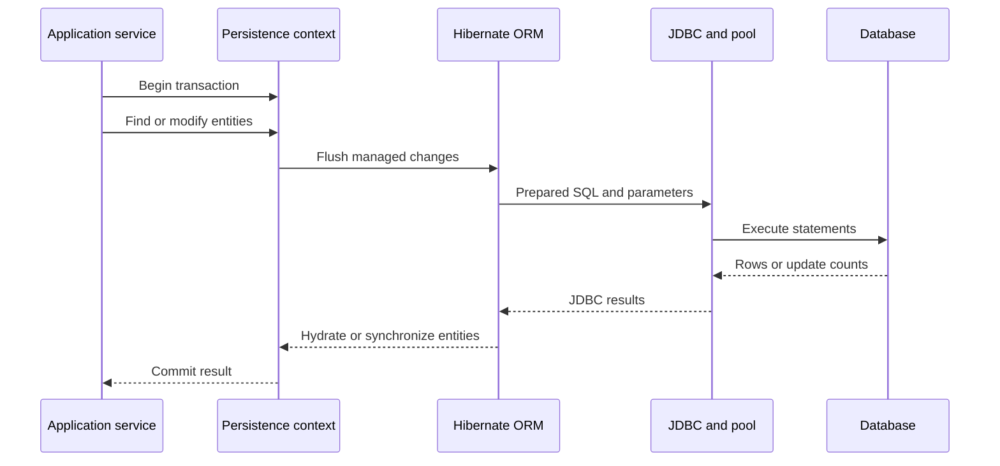
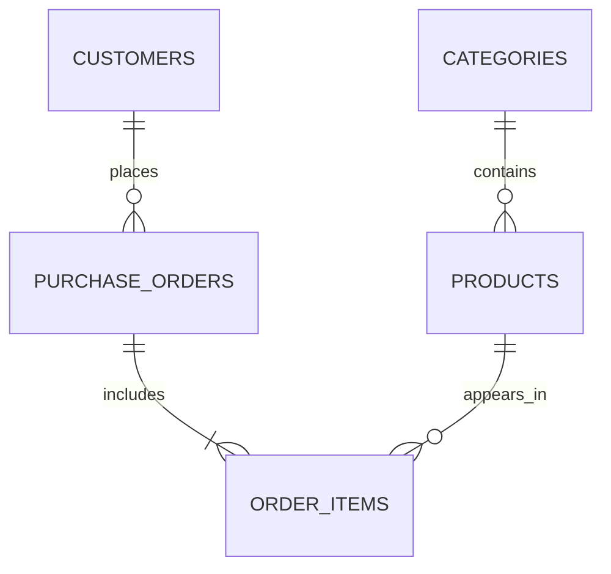
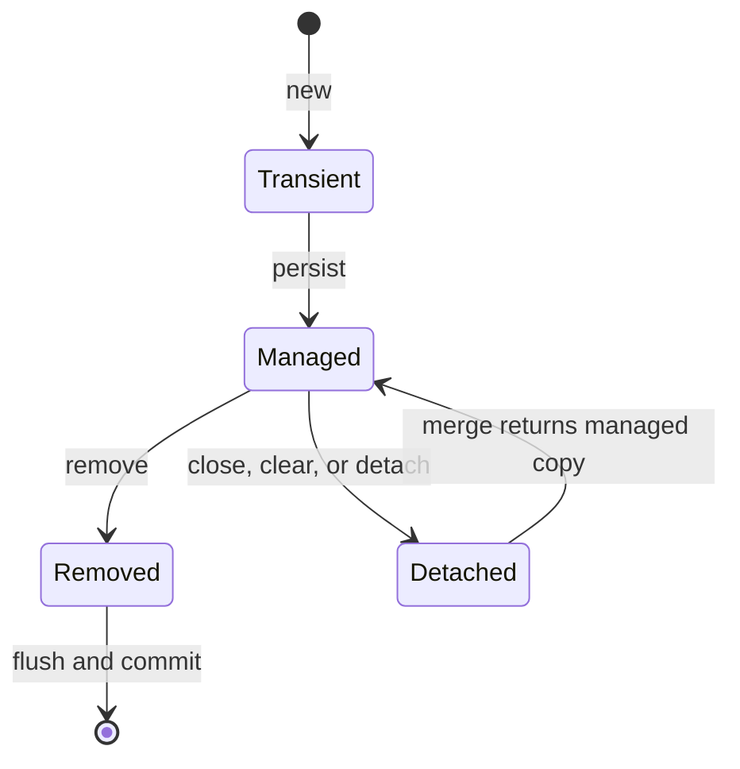
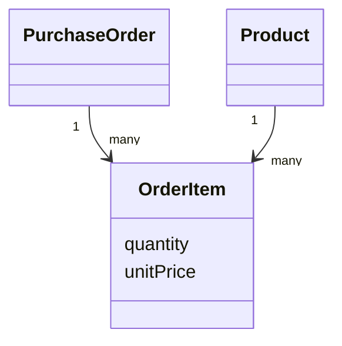

# Advanced Java Reference Material

> # Hibernate ORM 6.6

🏚️ [Home](index.md)

## Table of Contents

1. [What Is Hibernate ORM?](#1-what-is-hibernate-orm)
2. [Why Is Hibernate ORM Used?](#2-why-is-hibernate-orm-used)
3. [Hibernate Architecture and Execution Flow](#3-hibernate-architecture-and-execution-flow)
4. [Java 21 and Hibernate ORM 6.6 Requirements](#4-java-21-and-hibernate-orm-66-requirements)
5. [Hibernate ORM, Jakarta Persistence, and JDBC](#5-hibernate-orm-jakarta-persistence-and-jdbc)
6. [Project Structure and Maven Dependencies](#6-project-structure-and-maven-dependencies)
7. [Database Schema Used in the Examples](#7-database-schema-used-in-the-examples)
8. [Entity-Mapping Fundamentals](#8-entity-mapping-fundamentals)
9. [Native Hibernate Bootstrapping](#9-native-hibernate-bootstrapping)
10. [Jakarta Persistence Bootstrapping](#10-jakarta-persistence-bootstrapping)
11. [SessionFactory, Session, EntityManagerFactory, and EntityManager](#11-sessionfactory-session-entitymanagerfactory-and-entitymanager)
12. [Entity States and Life Cycle](#12-entity-states-and-life-cycle)
13. [Transactions and the Unit of Work](#13-transactions-and-the-unit-of-work)
14. [CRUD Operations](#14-crud-operations)
15. [Identifier Mapping and Generation](#15-identifier-mapping-and-generation)
16. [Basic Values, Enums, Dates, LOBs, and Converters](#16-basic-values-enums-dates-lobs-and-converters)
17. [Embeddables and Value Objects](#17-embeddables-and-value-objects)
18. [Association Mapping and Ownership](#18-association-mapping-and-ownership)
19. [One-to-One Mapping](#19-one-to-one-mapping)
20. [Many-to-One and One-to-Many Mapping](#20-many-to-one-and-one-to-many-mapping)
21. [Many-to-Many Mapping and Association Entities](#21-many-to-many-mapping-and-association-entities)
22. [Inheritance Mapping](#22-inheritance-mapping)
23. [Fetching, Proxies, and Concrete Proxies](#23-fetching-proxies-and-concrete-proxies)
24. [Cascades and Orphan Removal](#24-cascades-and-orphan-removal)
25. [Persistence Context, Dirty Checking, and Flushing](#25-persistence-context-dirty-checking-and-flushing)
26. [HQL and JPQL](#26-hql-and-jpql)
27. [Criteria API and Static Metamodel](#27-criteria-api-and-static-metamodel)
28. [Native SQL and Stored Procedures](#28-native-sql-and-stored-procedures)
29. [Pagination, Sorting, Projections, and Aggregation](#29-pagination-sorting-projections-and-aggregation)
30. [Locking and Concurrent Updates](#30-locking-and-concurrent-updates)
31. [First-Level, Second-Level, and Query Caches](#31-first-level-second-level-and-query-caches)
32. [JDBC Batching and Bulk Processing](#32-jdbc-batching-and-bulk-processing)
33. [The N+1 Problem and Performance Tuning](#33-the-n1-problem-and-performance-tuning)
34. [Connection Pooling, Dialects, and Configuration](#34-connection-pooling-dialects-and-configuration)
35. [Schema Generation, Naming, and Database Migrations](#35-schema-generation-naming-and-database-migrations)
36. [Filters, Soft Delete, and Multitenancy](#36-filters-soft-delete-and-multitenancy)
37. [Callbacks, Validation, and Auditing](#37-callbacks-validation-and-auditing)
38. [DAO and Service Layers Without Spring](#38-dao-and-service-layers-without-spring)
39. [Testing and Debugging Hibernate](#39-testing-and-debugging-hibernate)
40. [Hibernate ORM 6.6 Features and Migration Notes](#40-hibernate-orm-66-features-and-migration-notes)
41. [Best Practices and Common Hibernate Errors](#41-best-practices-and-common-hibernate-errors)
42. [Frequently Asked Interview Questions](#42-frequently-asked-interview-questions)

## 1. What Is Hibernate ORM?

**Hibernate ORM** is an object-relational mapping framework for Java and other JVM languages. It maps an object-oriented domain model to relational database tables and coordinates reading, inserting, updating, and deleting persistent data.

Hibernate lets application code work mainly with Java objects:

```java
Product product = entityManager.find(Product.class, 101L);
product.changePrice(new BigDecimal("1499.00"));
```

Within a transaction, Hibernate can translate these operations into SQL similar to:

```sql
select p.product_id, p.name, p.price
from products p
where p.product_id = ?;

update products
set price = ?
where product_id = ? and version = ?;
```

Hibernate provides:

- an implementation of **Jakarta Persistence 3.1**;
- its own native APIs, including `SessionFactory`, `Session`, and Hibernate Query Language;
- mapping annotations and XML mapping support;
- a persistence context and automatic dirty checking;
- association, inheritance, and value-type mapping;
- caching, batching, fetching, locking, and schema tooling; and
- optional modules for auditing, spatial data, vector data, connection pools, and caches.

Hibernate does not remove the need to understand relational modeling, SQL, indexes, constraints, transactions, or query plans. It provides an abstraction and a unit-of-work implementation, but the relational database still determines how SQL is executed.

[↑ Go to Table of Contents](#table-of-contents)

## 2. Why Is Hibernate ORM Used?

Hibernate ORM helps developers:

- map Java classes and relationships to relational tables;
- reduce repetitive JDBC result-set and parameter-mapping code;
- express queries using entity and attribute names;
- track managed entity changes automatically;
- define transaction-scoped units of work;
- load related data using configurable fetch plans;
- apply optimistic or pessimistic locking;
- reuse the same domain model across supported databases;
- batch related database operations; and
- integrate persistence with Jakarta EE, CDI, Spring, Quarkus, or plain Java SE.

### JDBC code vs Hibernate code

| JDBC-oriented code | Hibernate-oriented code |
| --- | --- |
| Opens connections and prepares statements directly | Uses an `EntityManager` or `Session` |
| Maps every result-set column manually | Maps rows to entity instances |
| Writes SQL for routine CRUD operations | Generates routine CRUD SQL from mappings |
| Manually tracks object changes | Uses persistence-context dirty checking |
| Represents relationships using foreign-key values | Represents relationships using object references |
| Remains ideal for exact low-level SQL control | Remains useful for rich domain models and units of work |

Hibernate and JDBC are not competitors at runtime. Hibernate ultimately uses JDBC for ordinary relational database access. Applications may also combine Hibernate-managed entity work with carefully selected native SQL when appropriate.

[↑ Go to Table of Contents](#table-of-contents)

## 3. Hibernate Architecture and Execution Flow

The main participants are:

| Participant | Responsibility |
| --- | --- |
| Application | Calls services, repositories, DAOs, or persistence APIs |
| `SessionFactory` / `EntityManagerFactory` | Holds immutable mapping metadata and creates persistence contexts |
| `Session` / `EntityManager` | Represents one persistence context and unit of work |
| Transaction | Defines the atomic database boundary |
| Hibernate ORM engine | Performs mapping, dirty checking, SQL generation, fetching, and caching |
| JDBC driver and connection pool | Carry SQL and values between Hibernate and the database |
| Relational database | Enforces constraints, stores rows, locks data, and executes SQL |



Typical processing is:

1. The application obtains a short-lived `EntityManager` or `Session`.
2. It begins a transaction.
3. Hibernate loads rows and creates managed entity instances as needed.
4. Application code changes those objects.
5. Hibernate detects managed changes when flushing.
6. Hibernate orders and executes SQL through JDBC.
7. The database commits or rolls back the transaction.
8. The application closes the persistence context.

The factory is normally created once for an application or persistence unit. The persistence context is created per request, command, message, job step, or other well-defined unit of work.

[↑ Go to Table of Contents](#table-of-contents)

## 4. Java 21 and Hibernate ORM 6.6 Requirements

This material uses the following baseline:

| Item | Version or requirement |
| --- | --- |
| Java | Java 21 |
| Hibernate ORM series | 6.6 |
| Example Hibernate patch | `6.6.57.Final` |
| Jakarta Persistence | 3.1 |
| Jakarta EE alignment | Jakarta EE 10 |
| Main Maven artifact | `org.hibernate.orm:hibernate-core` |
| Package namespace | `jakarta.persistence.*` |
| Database access | JDBC |

Hibernate ORM 6.6 supports Java 21. The official compatibility page also lists other supported Java versions, but these examples deliberately compile for Java 21.

Hibernate ORM 6.6 is now in **limited-support** mode. Existing applications may continue to use a current 6.6 patch, but a new production project should review Hibernate's active release and maintenance policy before selecting its long-term baseline.

The examples pin `6.6.57.Final`, which was the current 6.6 release when this guide was prepared. When maintaining a 6.6 application, use the newest compatible 6.6 patch allowed by the project and retest before upgrading.

Important official references:

- [Hibernate ORM 6.6 release page](https://hibernate.org/orm/releases/6.6/)
- [Hibernate ORM 6.6 Getting Started Guide](https://docs.hibernate.org/orm/6.6/quickstart/html_single/)
- [Hibernate ORM 6.6 User Guide](https://docs.hibernate.org/orm/6.6/userguide/html_single/)
- [Hibernate ORM 6.6 Query Language Guide](https://docs.hibernate.org/orm/6.6/querylanguage/html_single/Hibernate_Query_Language.html)
- [Hibernate ORM 6.6 Migration Guide](https://docs.hibernate.org/orm/6.6/migration-guide/)
- [Hibernate ORM 6.6 Javadocs](https://docs.hibernate.org/orm/6.6/javadocs/)
- [Jakarta Persistence 3.1 Specification](https://jakarta.ee/specifications/persistence/3.1/)

[↑ Go to Table of Contents](#table-of-contents)

## 5. Hibernate ORM, Jakarta Persistence, and JDBC

These three terms describe different layers:

| Technology | Role |
| --- | --- |
| JDBC | Standard low-level Java API for connections, SQL statements, parameters, result sets, and database metadata |
| Jakarta Persistence | Standard specification for ORM mapping and persistence APIs |
| Hibernate ORM | ORM implementation that implements Jakarta Persistence and adds native features |

The API types also correspond:

| Jakarta Persistence | Native Hibernate | General purpose |
| --- | --- | --- |
| `EntityManagerFactory` | `SessionFactory` | Thread-safe factory and mapping metadata |
| `EntityManager` | `Session` | Short-lived persistence context |
| `EntityTransaction` | `Transaction` | Resource-local transaction control |
| JPQL | HQL | Object-oriented query language |
| `TypedQuery<T>` | `SelectionQuery<T>` | Typed result query |
| `Query` | `MutationQuery` | Update, delete, or insert-select query |

Hibernate's `SessionFactory` extends `EntityManagerFactory`, and `Session` extends `EntityManager`. Therefore, Hibernate applications can use standard Jakarta Persistence operations and unwrap or directly use Hibernate APIs when a provider-specific feature is justified.

```java
Session session = entityManager.unwrap(Session.class);

SelectionQuery<Product> query = session.createSelectionQuery(
        "from Product p where p.status = :status",
        Product.class
);
```

### Which API should be chosen?

- Prefer Jakarta Persistence when provider portability and standard APIs are priorities.
- Use native Hibernate APIs for a feature that is not standardized or when its API is clearer.
- Keep provider-specific code localized so that the dependency is deliberate.
- Use direct JDBC or native SQL for operations where ORM adds no value or where exact database behavior is required.

Avoid claiming provider portability while relying throughout the application on Hibernate-only annotations, query syntax, hints, and bootstrap APIs.

[↑ Go to Table of Contents](#table-of-contents)

## 6. Project Structure and Maven Dependencies

A plain Java 21 Maven project may use this structure:

```text
hibernate-66-training/
├── pom.xml
└── src/
    ├── main/
    │   ├── java/
    │   │   └── com/company/training/
    │   │       ├── app/
    │   │       │   └── Main.java
    │   │       ├── config/
    │   │       │   ├── HibernateFactory.java
    │   │       │   └── JpaFactory.java
    │   │       ├── dao/
    │   │       │   └── ProductDao.java
    │   │       ├── domain/
    │   │       │   ├── Category.java
    │   │       │   └── Product.java
    │   │       └── service/
    │   │           └── ProductService.java
    │   └── resources/
    │       ├── hibernate.cfg.xml
    │       └── META-INF/
    │           └── persistence.xml
    └── test/
        ├── java/
        │   └── com/company/training/dao/
        │       └── ProductDaoTest.java
        └── resources/
            └── META-INF/
                └── persistence.xml
```

### Core Maven configuration

```xml
<?xml version="1.0" encoding="UTF-8"?>
<project xmlns="http://maven.apache.org/POM/4.0.0"
         xmlns:xsi="http://www.w3.org/2001/XMLSchema-instance"
         xsi:schemaLocation="http://maven.apache.org/POM/4.0.0
                             https://maven.apache.org/xsd/maven-4.0.0.xsd">
    <modelVersion>4.0.0</modelVersion>

    <groupId>com.company.training</groupId>
    <artifactId>hibernate-66-training</artifactId>
    <version>1.0.0</version>

    <properties>
        <maven.compiler.release>21</maven.compiler.release>
        <project.build.sourceEncoding>UTF-8</project.build.sourceEncoding>
        <hibernate.version>6.6.57.Final</hibernate.version>
        <junit.version>5.11.4</junit.version>
    </properties>

    <dependencyManagement>
        <dependencies>
            <dependency>
                <groupId>org.hibernate.orm</groupId>
                <artifactId>hibernate-platform</artifactId>
                <version>${hibernate.version}</version>
                <type>pom</type>
                <scope>import</scope>
            </dependency>
        </dependencies>
    </dependencyManagement>

    <dependencies>
        <dependency>
            <groupId>org.hibernate.orm</groupId>
            <artifactId>hibernate-core</artifactId>
        </dependency>

        <dependency>
            <groupId>com.mysql</groupId>
            <artifactId>mysql-connector-j</artifactId>
            <version>9.2.0</version>
            <scope>runtime</scope>
        </dependency>

        <dependency>
            <groupId>com.h2database</groupId>
            <artifactId>h2</artifactId>
            <version>2.3.232</version>
            <scope>test</scope>
        </dependency>

        <dependency>
            <groupId>org.junit.jupiter</groupId>
            <artifactId>junit-jupiter</artifactId>
            <version>${junit.version}</version>
            <scope>test</scope>
        </dependency>
    </dependencies>

    <build>
        <plugins>
            <plugin>
                <groupId>org.apache.maven.plugins</groupId>
                <artifactId>maven-compiler-plugin</artifactId>
                <version>3.14.0</version>
                <configuration>
                    <release>21</release>
                </configuration>
            </plugin>

            <plugin>
                <groupId>org.apache.maven.plugins</groupId>
                <artifactId>maven-surefire-plugin</artifactId>
                <version>3.5.2</version>
            </plugin>
        </plugins>
    </build>
</project>
```

`hibernate-core` is the ORM engine. The application must additionally provide the JDBC driver for its database. Production applications should also use a supported connection pool or a container-managed `DataSource`.

Useful optional Hibernate modules include:

| Module | Purpose |
| --- | --- |
| `hibernate-envers` | Entity revision auditing |
| `hibernate-jpamodelgen` | Static metamodel and repository annotation processor |
| `hibernate-hikaricp` | HikariCP integration |
| `hibernate-jcache` | Jakarta Cache integration |
| `hibernate-spatial` | Spatial and GIS mappings |
| `hibernate-vector` | Vector types and similarity functions |
| `hibernate-community-dialects` | Community-maintained database dialects |

[↑ Go to Table of Contents](#table-of-contents)

## 7. Database Schema Used in the Examples

The core examples use an e-commerce model:



A simplified MySQL schema is:

```sql
CREATE TABLE categories (
    category_id BIGINT PRIMARY KEY AUTO_INCREMENT,
    name VARCHAR(100) NOT NULL UNIQUE
);

CREATE TABLE products (
    product_id BIGINT PRIMARY KEY AUTO_INCREMENT,
    name VARCHAR(200) NOT NULL,
    sku VARCHAR(50) NOT NULL UNIQUE,
    price DECIMAL(12, 2) NOT NULL,
    status VARCHAR(20) NOT NULL,
    stock_quantity INT NOT NULL DEFAULT 0,
    version BIGINT NOT NULL DEFAULT 0,
    category_id BIGINT NOT NULL,
    created_at TIMESTAMP NOT NULL,
    updated_at TIMESTAMP NOT NULL,
    CONSTRAINT fk_products_category
        FOREIGN KEY (category_id) REFERENCES categories(category_id),
    CONSTRAINT chk_products_price CHECK (price >= 0)
);

CREATE INDEX idx_products_status ON products(status);
CREATE INDEX idx_products_category ON products(category_id);
```

The object model uses a `Category` reference instead of exposing `category_id` as an unrelated scalar:

```java
product.getCategory().getName();
```

Hibernate still stores and joins through the foreign-key column. Object relationships do not eliminate database keys or constraints.

For production systems:

- keep primary keys, foreign keys, unique constraints, and check constraints in the database;
- create indexes from real query and execution-plan evidence;
- use migrations to evolve the schema; and
- treat the ORM mapping and database schema as two representations of the same model.

[↑ Go to Table of Contents](#table-of-contents)

## 8. Entity-Mapping Fundamentals

An entity is a persistent domain object with an identity.

```java
package com.company.training.domain;

import java.math.BigDecimal;
import java.time.Instant;

import jakarta.persistence.Column;
import jakarta.persistence.Entity;
import jakarta.persistence.EnumType;
import jakarta.persistence.Enumerated;
import jakarta.persistence.FetchType;
import jakarta.persistence.GeneratedValue;
import jakarta.persistence.GenerationType;
import jakarta.persistence.Id;
import jakarta.persistence.JoinColumn;
import jakarta.persistence.ManyToOne;
import jakarta.persistence.Table;
import jakarta.persistence.Version;

import org.hibernate.annotations.CreationTimestamp;
import org.hibernate.annotations.UpdateTimestamp;

@Entity
@Table(name = "products")
public class Product {

    @Id
    @GeneratedValue(strategy = GenerationType.IDENTITY)
    @Column(name = "product_id")
    private Long id;

    @Column(nullable = false, length = 200)
    private String name;

    @Column(nullable = false, unique = true, length = 50)
    private String sku;

    @Column(nullable = false, precision = 12, scale = 2)
    private BigDecimal price;

    @Enumerated(EnumType.STRING)
    @Column(nullable = false, length = 20)
    private ProductStatus status;

    @Column(name = "stock_quantity", nullable = false)
    private int stockQuantity;

    @ManyToOne(fetch = FetchType.LAZY, optional = false)
    @JoinColumn(name = "category_id", nullable = false)
    private Category category;

    @Version
    @Column(nullable = false)
    private Long version;

    @CreationTimestamp
    @Column(name = "created_at", nullable = false, updatable = false)
    private Instant createdAt;

    @UpdateTimestamp
    @Column(name = "updated_at", nullable = false)
    private Instant updatedAt;

    protected Product() {
        // Required by Jakarta Persistence.
    }

    public Product(
            String name,
            String sku,
            BigDecimal price,
            Category category) {
        this.name = name;
        this.sku = sku;
        this.price = price;
        this.category = category;
        this.status = ProductStatus.ACTIVE;
    }

    public void changePrice(BigDecimal newPrice) {
        if (newPrice == null || newPrice.signum() < 0) {
            throw new IllegalArgumentException("Price must be non-negative");
        }
        this.price = newPrice;
    }

    public void addStock(int quantity) {
        if (quantity <= 0) {
            throw new IllegalArgumentException("Quantity must be positive");
        }
        stockQuantity += quantity;
    }

    public void removeStock(int quantity) {
        if (quantity <= 0 || quantity > stockQuantity) {
            throw new IllegalArgumentException("Invalid stock quantity");
        }
        stockQuantity -= quantity;
    }

    public Long getId() {
        return id;
    }

    public String getName() {
        return name;
    }

    public String getSku() {
        return sku;
    }

    public BigDecimal getPrice() {
        return price;
    }

    public ProductStatus getStatus() {
        return status;
    }

    public Category getCategory() {
        return category;
    }

    public Long getVersion() {
        return version;
    }
}
```

```java
package com.company.training.domain;

public enum ProductStatus {
    ACTIVE,
    INACTIVE,
    DISCONTINUED,
    DRAFT
}
```

### Core entity rules

- Mark the class with `@Entity`.
- Declare exactly one entity identifier through `@Id` or `@EmbeddedId`.
- Provide a public or protected no-argument constructor.
- Do not declare the entity class, persistent getters, or persistent fields `final` when proxy-based laziness is required.
- Keep one access strategy: place mapping annotations consistently on fields or consistently on getters.
- Map database nullability, length, precision, uniqueness, and foreign-key intent accurately.
- Prefer behavior-oriented methods such as `changePrice()` over unrestricted setters when the domain has invariants.

### Field access vs property access

The location of `@Id` normally determines the default access strategy:

| `@Id` location | Access strategy | Hibernate reads and writes |
| --- | --- | --- |
| Field | Field access | Fields directly |
| Getter | Property access | JavaBean getter and setter methods |

Use `@Access` only when a deliberate override is needed. Inconsistent annotation placement can produce confusing unmapped or duplicated state.

[↑ Go to Table of Contents](#table-of-contents)

## 9. Native Hibernate Bootstrapping

Native bootstrap creates a Hibernate `SessionFactory` directly.

### `hibernate.cfg.xml`

Place this file in `src/main/resources`:

```xml
<?xml version="1.0" encoding="UTF-8"?>
<!DOCTYPE hibernate-configuration PUBLIC
        "-//Hibernate/Hibernate Configuration DTD 3.0//EN"
        "https://hibernate.org/dtd/hibernate-configuration-3.0.dtd">
<hibernate-configuration>
    <session-factory>
        <property name="jakarta.persistence.jdbc.driver">
            com.mysql.cj.jdbc.Driver
        </property>
        <property name="jakarta.persistence.jdbc.url">
            jdbc:mysql://localhost:3306/training_db
        </property>
        <property name="jakarta.persistence.jdbc.user">
            ${DB_USERNAME}
        </property>
        <property name="jakarta.persistence.jdbc.password">
            ${DB_PASSWORD}
        </property>

        <property name="hibernate.show_sql">true</property>
        <property name="hibernate.format_sql">true</property>
        <property name="hibernate.highlight_sql">true</property>
        <property name="hibernate.hbm2ddl.auto">validate</property>

        <mapping class="com.company.training.domain.Category"/>
        <mapping class="com.company.training.domain.Product"/>
    </session-factory>
</hibernate-configuration>
```

XML configuration does not automatically expand operating-system environment variables in every setup. A safer plain-Java bootstrap reads required environment variables explicitly and passes them as settings.

### Factory utility

```java
package com.company.training.config;

import java.util.HashMap;
import java.util.Map;

import org.hibernate.SessionFactory;
import org.hibernate.boot.MetadataSources;
import org.hibernate.boot.registry.StandardServiceRegistry;
import org.hibernate.boot.registry.StandardServiceRegistryBuilder;
import org.hibernate.cfg.JdbcSettings;

import com.company.training.domain.Category;
import com.company.training.domain.Product;

public final class HibernateFactory {

    private static final SessionFactory SESSION_FACTORY = buildSessionFactory();

    private HibernateFactory() {
    }

    private static SessionFactory buildSessionFactory() {
        Map<String, Object> settings = new HashMap<>();
        settings.put(
                JdbcSettings.JAKARTA_JDBC_URL,
                env("DB_URL")
        );
        settings.put(
                JdbcSettings.JAKARTA_JDBC_USER,
                env("DB_USERNAME")
        );
        settings.put(
                JdbcSettings.JAKARTA_JDBC_PASSWORD,
                env("DB_PASSWORD")
        );
        settings.put("hibernate.hbm2ddl.auto", "validate");
        settings.put("hibernate.format_sql", true);

        StandardServiceRegistry registry =
                new StandardServiceRegistryBuilder()
                        .applySettings(settings)
                        .build();

        try {
            return new MetadataSources(registry)
                    .addAnnotatedClass(Category.class)
                    .addAnnotatedClass(Product.class)
                    .buildMetadata()
                    .buildSessionFactory();
        } catch (RuntimeException exception) {
            StandardServiceRegistryBuilder.destroy(registry);
            throw exception;
        }
    }

    private static String env(String name) {
        String value = System.getenv(name);
        if (value == null || value.isBlank()) {
            throw new IllegalStateException(
                    "Missing required environment variable: " + name
            );
        }
        return value;
    }

    public static SessionFactory getSessionFactory() {
        return SESSION_FACTORY;
    }

    public static void close() {
        SESSION_FACTORY.close();
    }
}
```

Build the factory once, reuse it, and close it during application shutdown. Do not build a factory for each DAO method.

[↑ Go to Table of Contents](#table-of-contents)

## 10. Jakarta Persistence Bootstrapping

Jakarta Persistence bootstrap creates an `EntityManagerFactory` from a named persistence unit.

### `META-INF/persistence.xml`

Place this file at `src/main/resources/META-INF/persistence.xml`:

```xml
<?xml version="1.0" encoding="UTF-8"?>
<persistence xmlns="https://jakarta.ee/xml/ns/persistence"
             xmlns:xsi="http://www.w3.org/2001/XMLSchema-instance"
             xsi:schemaLocation="https://jakarta.ee/xml/ns/persistence
                                 https://jakarta.ee/xml/ns/persistence/persistence_3_1.xsd"
             version="3.1">

    <persistence-unit name="trainingPU"
                      transaction-type="RESOURCE_LOCAL">
        <provider>org.hibernate.jpa.HibernatePersistenceProvider</provider>

        <class>com.company.training.domain.Category</class>
        <class>com.company.training.domain.Product</class>

        <properties>
            <property name="hibernate.hbm2ddl.auto" value="validate"/>
            <property name="hibernate.format_sql" value="true"/>
            <property name="hibernate.show_sql" value="true"/>
        </properties>
    </persistence-unit>
</persistence>
```

Connection values may be supplied at runtime so that credentials are not committed to source control:

```java
package com.company.training.config;

import java.util.Map;

import jakarta.persistence.EntityManagerFactory;
import jakarta.persistence.Persistence;

public final class JpaFactory {

    private static final EntityManagerFactory ENTITY_MANAGER_FACTORY =
            Persistence.createEntityManagerFactory(
                    "trainingPU",
                    Map.of(
                            "jakarta.persistence.jdbc.url", env("DB_URL"),
                            "jakarta.persistence.jdbc.user", env("DB_USERNAME"),
                            "jakarta.persistence.jdbc.password", env("DB_PASSWORD")
                    )
            );

    private JpaFactory() {
    }

    private static String env(String name) {
        String value = System.getenv(name);
        if (value == null || value.isBlank()) {
            throw new IllegalStateException(
                    "Missing required environment variable: " + name
            );
        }
        return value;
    }

    public static EntityManagerFactory getEntityManagerFactory() {
        return ENTITY_MANAGER_FACTORY;
    }

    public static void close() {
        ENTITY_MANAGER_FACTORY.close();
    }
}
```

### Resource-local vs JTA

| Transaction type | Typical environment | Transaction control |
| --- | --- | --- |
| `RESOURCE_LOCAL` | Java SE or a single manually managed data source | `EntityTransaction` |
| `JTA` | Jakarta EE or another JTA environment | Container or `UserTransaction` |

Do not manually call resource-local transaction methods on a container-managed JTA persistence context.

[↑ Go to Table of Contents](#table-of-contents)

## 11. SessionFactory, Session, EntityManagerFactory, and EntityManager

Correct scope is fundamental:

| Type | Expensive to create? | Thread-safe? | Recommended scope |
| --- | --- | --- | --- |
| `SessionFactory` | Yes | Yes | One per database mapping or persistence unit |
| `EntityManagerFactory` | Yes | Yes | One per persistence unit |
| `Session` | No | No | One unit of work |
| `EntityManager` | No | No | One unit of work |
| `Transaction` / `EntityTransaction` | No | No | One transaction boundary |

### Native Hibernate pattern

```java
try (Session session = sessionFactory.openSession()) {
    Transaction transaction = session.beginTransaction();

    try {
        Product product = session.find(Product.class, productId);
        product.changePrice(newPrice);

        transaction.commit();
    } catch (RuntimeException exception) {
        if (transaction.isActive()) {
            transaction.rollback();
        }
        throw exception;
    }
}
```

### Jakarta Persistence pattern

```java
EntityManager entityManager = entityManagerFactory.createEntityManager();
EntityTransaction transaction = entityManager.getTransaction();

try {
    transaction.begin();

    Product product = entityManager.find(Product.class, productId);
    product.changePrice(newPrice);

    transaction.commit();
} catch (RuntimeException exception) {
    if (transaction.isActive()) {
        transaction.rollback();
    }
    throw exception;
} finally {
    entityManager.close();
}
```

Never place one `Session` or `EntityManager` in a singleton DAO and share it between threads. Share the factory, then create a persistence context for each unit of work.

[↑ Go to Table of Contents](#table-of-contents)

## 12. Entity States and Life Cycle

An entity instance can move through four important states:



| State | Meaning |
| --- | --- |
| Transient | Ordinary new object not associated with a persistence context |
| Managed or persistent | Tracked by the current persistence context |
| Detached | Has persistent identity but is no longer tracked by that context |
| Removed | Managed entity scheduled for deletion |

### Transient to managed

```java
Product product = new Product(
        "Mechanical Keyboard",
        "KEY-1001",
        new BigDecimal("5499.00"),
        category
);

entityManager.persist(product);
```

`persist()` makes that same Java object managed. Depending on identifier strategy and flush timing, SQL may execute immediately or later.

### Managed to detached

An entity becomes detached when:

- its persistence context is closed;
- `clear()` detaches every managed entity;
- `detach(entity)` or `evict(entity)` is called; or
- a serialized entity is transferred outside the original context.

### Merging detached state

```java
Product managedCopy = entityManager.merge(detachedProduct);
```

`merge()` copies state into a managed instance and returns that managed instance. The argument itself remains detached.

```java
Product managed = entityManager.merge(detached);

// Continue with the returned managed instance.
managed.changePrice(new BigDecimal("4999.00"));
```

Hibernate 6.6 may throw `OptimisticLockException` when a definitely detached versioned or generated-id entity is merged after its database row was deleted. It no longer silently treats that case as an insert when detachment can be determined.

[↑ Go to Table of Contents](#table-of-contents)

## 13. Transactions and the Unit of Work

A transaction should represent one complete atomic business operation.

```java
public void transferStock(
        long sourceProductId,
        long targetProductId,
        int quantity) {

    EntityManager entityManager =
            entityManagerFactory.createEntityManager();
    EntityTransaction transaction = entityManager.getTransaction();

    try {
        transaction.begin();

        Product source = entityManager.find(
                Product.class,
                sourceProductId,
                LockModeType.OPTIMISTIC
        );
        Product target = entityManager.find(
                Product.class,
                targetProductId,
                LockModeType.OPTIMISTIC
        );

        source.removeStock(quantity);
        target.addStock(quantity);

        transaction.commit();
    } catch (RuntimeException exception) {
        if (transaction.isActive()) {
            transaction.rollback();
        }
        throw exception;
    } finally {
        entityManager.close();
    }
}
```

### Transaction rules

- Use a transaction for both writes and consistent read operations.
- Put the transaction boundary around the service operation, not each DAO statement.
- Roll back after any failure while the transaction is active.
- Discard the persistence context after a Hibernate persistence exception.
- Keep database transactions short, but long enough to complete one atomic operation.
- Do not hold a transaction open while waiting for user input, remote calls, or slow unrelated work.
- Do not rely on database auto-commit for multi-step business behavior.

### Session-per-operation anti-pattern

Opening and closing a separate persistence context for every DAO call prevents one service operation from sharing:

- a transaction;
- identity guarantees;
- dirty checking;
- batched writes; and
- a coherent persistence context.

One service call often invokes several DAOs using the same transaction-scoped persistence context.

[↑ Go to Table of Contents](#table-of-contents)

## 14. CRUD Operations

CRUD means create, read, update, and delete.

### Create

```java
entityManager.getTransaction().begin();

Category category = entityManager.find(Category.class, categoryId);
Product product = new Product(
        "Wireless Mouse",
        "MOU-2001",
        new BigDecimal("1299.00"),
        category
);

entityManager.persist(product);
entityManager.getTransaction().commit();
```

### Read by primary key

```java
Product product = entityManager.find(Product.class, productId);

if (product == null) {
    throw new ProductNotFoundException(productId);
}
```

`find()` returns `null` when no row exists. A reference can be obtained without immediately loading all entity state:

```java
Product reference = entityManager.getReference(Product.class, productId);
```

`getReference()` may return a proxy and may report a missing row only when state is accessed or synchronization requires it.

### Update a managed entity

```java
entityManager.getTransaction().begin();

Product product = entityManager.find(Product.class, productId);
product.changePrice(new BigDecimal("1199.00"));

entityManager.getTransaction().commit();
```

There is no required explicit `update()` call for a managed entity. Dirty checking schedules the SQL update.

### Merge detached state

```java
entityManager.getTransaction().begin();
Product managed = entityManager.merge(detachedProduct);
entityManager.getTransaction().commit();
```

Prefer loading the managed entity and applying an intentional command or DTO where possible. Blindly merging client-supplied entity graphs can overwrite fields that were not meant to change.

### Delete

```java
entityManager.getTransaction().begin();

Product product = entityManager.find(Product.class, productId);
if (product != null) {
    entityManager.remove(product);
}

entityManager.getTransaction().commit();
```

`remove()` expects a managed entity. To delete by identifier without first materializing the whole entity, a reference is often enough:

```java
Product reference = entityManager.getReference(Product.class, productId);
entityManager.remove(reference);
```

Database foreign keys, ORM cascades, and soft-delete rules still affect whether the operation succeeds and which related rows change.

[↑ Go to Table of Contents](#table-of-contents)

## 15. Identifier Mapping and Generation

Every entity needs a stable identifier.

### Simple generated identifier

```java
@Id
@GeneratedValue(strategy = GenerationType.IDENTITY)
@Column(name = "product_id")
private Long id;
```

Common standard strategies are:

| Strategy | Meaning | Important consideration |
| --- | --- | --- |
| `AUTO` | Provider chooses a suitable strategy | Generated schema may vary by database |
| `IDENTITY` | Database identity or auto-increment column | Insert may be needed early; insert batching is restricted |
| `SEQUENCE` | Database sequence | Usually efficient with allocation and batching |
| `TABLE` | Separate table emulates a sequence | Portable but often introduces contention |
| `UUID` | UUID generation defined by Jakarta Persistence 3.1 | Useful for distributed identifier creation |

### Sequence identifier

```java
@Id
@GeneratedValue(
        strategy = GenerationType.SEQUENCE,
        generator = "product_sequence"
)
@SequenceGenerator(
        name = "product_sequence",
        sequenceName = "product_seq",
        allocationSize = 50
)
private Long id;
```

`allocationSize` lets Hibernate reserve identifier ranges and reduces sequence calls. The database sequence increment and mapping allocation must be intentionally aligned.

### UUID identifier

```java
@Id
@GeneratedValue(strategy = GenerationType.UUID)
private UUID id;
```

Hibernate also provides `@UuidGenerator` when Hibernate-specific control is required:

```java
@Id
@UuidGenerator
private UUID id;
```

Choose a database column type and indexing strategy suitable for UUID values. Random UUIDs may fragment some clustered indexes.

### Assigned identifiers

```java
@Id
@Column(name = "country_code", length = 2)
private String code;
```

An application-assigned identifier must be set before `persist()`.

### Composite identifier with `@EmbeddedId`

```java
@Embeddable
public class OrderItemId implements Serializable {

    @Column(name = "order_id")
    private Long orderId;

    @Column(name = "product_id")
    private Long productId;

    protected OrderItemId() {
    }

    public OrderItemId(Long orderId, Long productId) {
        this.orderId = orderId;
        this.productId = productId;
    }

    @Override
    public boolean equals(Object object) {
        if (this == object) {
            return true;
        }
        if (!(object instanceof OrderItemId other)) {
            return false;
        }
        return Objects.equals(orderId, other.orderId)
                && Objects.equals(productId, other.productId);
    }

    @Override
    public int hashCode() {
        return Objects.hash(orderId, productId);
    }
}
```

```java
@Entity
@Table(name = "order_items")
public class OrderItem {

    @EmbeddedId
    private OrderItemId id;

    @MapsId("orderId")
    @ManyToOne(fetch = FetchType.LAZY, optional = false)
    @JoinColumn(name = "order_id")
    private PurchaseOrder order;

    @MapsId("productId")
    @ManyToOne(fetch = FetchType.LAZY, optional = false)
    @JoinColumn(name = "product_id")
    private Product product;

    @Column(nullable = false)
    private int quantity;
}
```

A composite-id class must be serializable and implement value-based `equals()` and `hashCode()`. `@IdClass` is another standard option, but `@EmbeddedId` usually keeps the key structure explicit.

### Natural identifiers

```java
@NaturalId(mutable = false)
@Column(nullable = false, unique = true, length = 50)
private String sku;
```

```java
Product product = session.bySimpleNaturalId(Product.class)
        .load("MOU-2001");
```

A natural key can be useful for lookup and uniqueness, but a surrogate primary key is often still easier for relationships and mutation-safe identity.

[↑ Go to Table of Contents](#table-of-contents)

## 16. Basic Values, Enums, Dates, LOBs, and Converters

Hibernate maps Java values through a Java type, a JDBC type, and the database column type selected by the dialect.

### Common basic mappings

```java
@Column(nullable = false, length = 200)
private String name;

@Column(nullable = false, precision = 12, scale = 2)
private BigDecimal price;

@Column(nullable = false)
private boolean taxable;

@Column(name = "released_on")
private LocalDate releasedOn;

@Column(name = "created_at", nullable = false)
private Instant createdAt;
```

Prefer `java.time` types such as `LocalDate`, `LocalDateTime`, `OffsetDateTime`, and `Instant` over legacy `Date` and `Calendar` in new code.

### Enum mapping

```java
@Enumerated(EnumType.STRING)
@Column(nullable = false, length = 20)
private ProductStatus status;
```

`EnumType.STRING` stores names such as `ACTIVE`. `EnumType.ORDINAL` stores numeric positions and can corrupt meaning when enum constants are reordered or inserted. String storage is normally safer.

### Large objects

```java
@Lob
@Basic(fetch = FetchType.LAZY)
@Column(name = "manual_text")
private String manualText;

@Lob
@Basic(fetch = FetchType.LAZY)
@Column(name = "preview_image")
private byte[] previewImage;
```

LOB behavior differs between databases and drivers. Do not assume `LAZY` basic-field loading works without bytecode enhancement. Storing large files in object storage and keeping metadata in the database may be more appropriate.

### Attribute converter

```java
public enum Availability {
    AVAILABLE("A"),
    UNAVAILABLE("U");

    private final String databaseCode;

    Availability(String databaseCode) {
        this.databaseCode = databaseCode;
    }

    public String databaseCode() {
        return databaseCode;
    }

    public static Availability fromDatabaseCode(String code) {
        return Arrays.stream(values())
                .filter(value -> value.databaseCode.equals(code))
                .findFirst()
                .orElseThrow(() ->
                        new IllegalArgumentException("Unknown code: " + code));
    }
}
```

```java
@Converter(autoApply = false)
public class AvailabilityConverter
        implements AttributeConverter<Availability, String> {

    @Override
    public String convertToDatabaseColumn(Availability value) {
        return value == null ? null : value.databaseCode();
    }

    @Override
    public Availability convertToEntityAttribute(String value) {
        return value == null
                ? null
                : Availability.fromDatabaseCode(value);
    }
}
```

```java
@Convert(converter = AvailabilityConverter.class)
@Column(name = "availability_code", length = 1)
private Availability availability;
```

### JSON and SQL arrays

Hibernate-specific JDBC type selection may be used when the dialect and database support it:

```java
@JdbcTypeCode(SqlTypes.JSON)
@Column(name = "attributes_json")
private Map<String, Object> attributes;
```

```java
@JdbcTypeCode(SqlTypes.ARRAY)
@Column(name = "search_tags")
private String[] searchTags;
```

JSON library requirements, array support, generated DDL, functions, and physical column types vary by database. Verify the mapping against the target dialect instead of assuming cross-database portability.

[↑ Go to Table of Contents](#table-of-contents)

## 17. Embeddables and Value Objects

An embeddable models a reusable value whose columns are stored as part of an owning entity table.

```java
@Embeddable
public class Money {

    @Column(name = "amount", nullable = false, precision = 12, scale = 2)
    private BigDecimal amount;

    @Column(name = "currency", nullable = false, length = 3)
    private String currency;

    protected Money() {
    }

    public Money(BigDecimal amount, String currency) {
        if (amount == null || amount.signum() < 0) {
            throw new IllegalArgumentException("Amount must be non-negative");
        }
        this.amount = amount;
        this.currency = Objects.requireNonNull(currency);
    }
}
```

```java
@Embedded
@AttributeOverrides({
    @AttributeOverride(
            name = "amount",
            column = @Column(
                    name = "unit_price",
                    precision = 12,
                    scale = 2,
                    nullable = false
            )
    ),
    @AttributeOverride(
            name = "currency",
            column = @Column(
                    name = "currency_code",
                    length = 3,
                    nullable = false
            )
    )
})
private Money price;
```

Embeddables:

- do not have independent entity identity;
- are normally owned as part of an entity's state;
- may contain basic attributes and associations;
- may be reused with attribute or association overrides; and
- work well for values such as money, address, date range, and measurements.

### Element collection

```java
@ElementCollection
@CollectionTable(
        name = "product_labels",
        joinColumns = @JoinColumn(name = "product_id")
)
@Column(name = "label", nullable = false, length = 50)
private Set<String> labels = new HashSet<>();
```

An element collection stores basic or embeddable values, not entities. Replacing or modifying a large collection may cause substantial delete-and-insert work, so model frequently updated rows as entities when independent identity is useful.

### Embeddable inheritance in Hibernate 6.6

Hibernate ORM 6.6 supports discriminator-based inheritance for embeddables:

```java
@Embeddable
@DiscriminatorColumn(name = "contact_type")
@DiscriminatorValue("BASE")
public class ContactMethod {

    @Column(name = "contact_label")
    private String label;
}
```

```java
@Embeddable
@DiscriminatorValue("EMAIL")
public class EmailContact extends ContactMethod {

    @Column(name = "email_address")
    private String emailAddress;
}
```

```java
@Embedded
private ContactMethod preferredContact;
```

Hibernate stores a discriminator with the embedded columns and creates the correct subtype when reading the entity. Embeddable inheritance is also supported for `@ElementCollection`, but not for `@EmbeddedId`, an embeddable used as an `@IdClass`, or a value using a custom composite type.

[↑ Go to Table of Contents](#table-of-contents)

## 18. Association Mapping and Ownership

Associations represent foreign-key relationships as object references or collections.

| Association | Typical relational form |
| --- | --- |
| `@ManyToOne` | Foreign key in the source table |
| `@OneToMany` | Foreign key in the target table |
| `@OneToOne` | Unique foreign key or shared primary key |
| `@ManyToMany` | Join table with two foreign keys |

### Owning side

The **owning side** is the side whose mapping controls the foreign key or join-table row. In a bidirectional association, the inverse side uses `mappedBy`.

```java
@ManyToOne(fetch = FetchType.LAZY, optional = false)
@JoinColumn(name = "category_id", nullable = false)
private Category category;
```

```java
@OneToMany(mappedBy = "category")
private List<Product> products = new ArrayList<>();
```

`Product.category` owns this relationship because the `products.category_id` foreign key belongs to the product table. `Category.products` is the inverse view.

### Keep both object sides synchronized

```java
public void addProduct(Product product) {
    products.add(product);
    product.assignCategory(this);
}

public void removeProduct(Product product) {
    products.remove(product);
    product.removeCategory(this);
}
```

Changing only the inverse collection does not change the foreign key. Helper methods protect the in-memory object graph and make ownership explicit.

### Unidirectional vs bidirectional

| Choose unidirectional when | Choose bidirectional when |
| --- | --- |
| Navigation is only required in one direction | Both navigation directions are part of real use cases |
| A smaller, simpler model is enough | Aggregate behavior needs both sides |
| The reverse collection would be large or rarely used | The reverse collection is bounded and frequently needed |

Do not add a bidirectional collection merely because a foreign key exists. Model navigation required by the domain and queries.

[↑ Go to Table of Contents](#table-of-contents)

## 19. One-to-One Mapping

A one-to-one association can use a unique foreign key.

```java
@Entity
@Table(name = "customer_profiles")
public class CustomerProfile {

    @Id
    @GeneratedValue(strategy = GenerationType.IDENTITY)
    @Column(name = "profile_id")
    private Long id;

    @OneToOne(fetch = FetchType.LAZY, optional = false)
    @JoinColumn(
            name = "customer_id",
            nullable = false,
            unique = true
    )
    private Customer customer;

    @Column(name = "display_name", nullable = false)
    private String displayName;
}
```

```java
@OneToOne(
        mappedBy = "customer",
        fetch = FetchType.LAZY,
        cascade = CascadeType.ALL,
        orphanRemoval = true
)
private CustomerProfile profile;
```

The side with `@JoinColumn` owns the unique foreign key. The other side refers to the owner through `mappedBy`.

### Shared primary key with `@MapsId`

```java
@Entity
@Table(name = "customer_profiles")
public class CustomerProfile {

    @Id
    @Column(name = "customer_id")
    private Long id;

    @MapsId
    @OneToOne(fetch = FetchType.LAZY, optional = false)
    @JoinColumn(name = "customer_id")
    private Customer customer;
}
```

In this model, the profile's primary key is also a foreign key to its customer.

### One-to-one caution

- Enforce uniqueness in the database.
- Decide which row may exist first.
- Understand that lazy inverse one-to-one loading can require extra provider knowledge or bytecode enhancement.
- Consider whether the value really needs a separate entity; an embeddable may be simpler when it has no independent identity or life cycle.

[↑ Go to Table of Contents](#table-of-contents)

## 20. Many-to-One and One-to-Many Mapping

Many products may belong to one category.

```java
@Entity
@Table(name = "categories")
public class Category {

    @Id
    @GeneratedValue(strategy = GenerationType.IDENTITY)
    @Column(name = "category_id")
    private Long id;

    @Column(nullable = false, unique = true, length = 100)
    private String name;

    @OneToMany(
            mappedBy = "category",
            cascade = CascadeType.PERSIST
    )
    @OrderBy("name asc")
    private List<Product> products = new ArrayList<>();

    protected Category() {
    }

    public Category(String name) {
        this.name = name;
    }

    public void addProduct(Product product) {
        products.add(product);
        product.assignCategory(this);
    }

    public void removeProduct(Product product) {
        products.remove(product);
        product.removeCategory(this);
    }
}
```

```java
@ManyToOne(fetch = FetchType.LAZY, optional = false)
@JoinColumn(name = "category_id", nullable = false)
private Category category;

void assignCategory(Category category) {
    this.category = Objects.requireNonNull(category);
}

void removeCategory(Category category) {
    if (this.category == category) {
        this.category = null;
    }
}
```

The shown schema declares `category_id` non-null, so `removeCategory()` may only be used as part of deletion or reassignment before flush. Domain helper behavior must remain consistent with database constraints.

### Unidirectional one-to-many

A unidirectional one-to-many can use a join table:

```java
@OneToMany
@JoinTable(
        name = "featured_products",
        joinColumns = @JoinColumn(name = "category_id"),
        inverseJoinColumns = @JoinColumn(name = "product_id")
)
private Set<Product> featuredProducts = new HashSet<>();
```

For a normal parent-child foreign key, a bidirectional mapping with `@ManyToOne` as owner is often more efficient and explicit than a unidirectional one-to-many join table.

### Collection choices

| Java type | Typical use |
| --- | --- |
| `Set` | Unique elements; correct equality is important |
| `List` | Ordered values or bag semantics |
| `List` with `@OrderColumn` | Persistent element position |
| `Map` | Key-based association or value access |

Do not initialize persistent collections with immutable implementations such as `List.of()` when Hibernate and domain methods must modify them.

[↑ Go to Table of Contents](#table-of-contents)

## 21. Many-to-Many Mapping and Association Entities

A direct many-to-many uses a join table:

```java
@ManyToMany
@JoinTable(
        name = "product_tags",
        joinColumns = @JoinColumn(name = "product_id"),
        inverseJoinColumns = @JoinColumn(name = "tag_id")
)
private Set<Tag> tags = new HashSet<>();
```

```java
@ManyToMany(mappedBy = "tags")
private Set<Product> products = new HashSet<>();
```

Avoid `CascadeType.REMOVE` across an ordinary many-to-many association. Removing one product must not delete tag entities still used by other products.

### Prefer an association entity when the relationship has data

An order-product relationship has quantity, unit price, and perhaps discount. Model the join row as `OrderItem`:



```java
@Entity
@Table(name = "order_items")
public class OrderItem {

    @EmbeddedId
    private OrderItemId id;

    @MapsId("orderId")
    @ManyToOne(fetch = FetchType.LAZY, optional = false)
    @JoinColumn(name = "order_id")
    private PurchaseOrder order;

    @MapsId("productId")
    @ManyToOne(fetch = FetchType.LAZY, optional = false)
    @JoinColumn(name = "product_id")
    private Product product;

    @Column(nullable = false)
    private int quantity;

    @Column(name = "unit_price", nullable = false,
            precision = 12, scale = 2)
    private BigDecimal unitPrice;
}
```

This design offers:

- a place for relationship attributes;
- direct query access to the join row;
- explicit cascade and deletion behavior;
- easier auditing; and
- better control than a hidden many-to-many table.

[↑ Go to Table of Contents](#table-of-contents)

## 22. Inheritance Mapping

Jakarta Persistence provides three entity-inheritance strategies plus mapped superclasses.

### `@MappedSuperclass`

```java
@MappedSuperclass
public abstract class BaseEntity {

    @Id
    @GeneratedValue(strategy = GenerationType.IDENTITY)
    private Long id;

    @Version
    private Long version;

    public Long getId() {
        return id;
    }
}
```

A mapped superclass contributes mappings but is not itself a queryable entity and has no separate table.

### Single-table inheritance

```java
@Entity
@Inheritance(strategy = InheritanceType.SINGLE_TABLE)
@DiscriminatorColumn(name = "payment_type")
public abstract class Payment {

    @Id
    @GeneratedValue(strategy = GenerationType.IDENTITY)
    private Long id;

    private BigDecimal amount;
}
```

```java
@Entity
@DiscriminatorValue("CARD")
public class CardPayment extends Payment {

    private String maskedCardNumber;
}
```

### Joined inheritance

```java
@Entity
@Inheritance(strategy = InheritanceType.JOINED)
public abstract class Payment {
    // Common state
}
```

Each subtype has its own table joined to the root table by primary key.

### Table-per-class inheritance

```java
@Entity
@Inheritance(strategy = InheritanceType.TABLE_PER_CLASS)
public abstract class Payment {
    // Common state
}
```

Each concrete class has a table containing inherited columns. Polymorphic queries may require a union.

### Strategy comparison

| Strategy | Strength | Trade-off |
| --- | --- | --- |
| `SINGLE_TABLE` | Fast polymorphic queries; no joins | Nullable subtype columns; one wide table |
| `JOINED` | Normalized schema | Joins for subtype loading and polymorphic queries |
| `TABLE_PER_CLASS` | Separate concrete tables | Union-based polymorphic queries; key generation limitations |
| `@MappedSuperclass` | Reuses mappings simply | Base type is not polymorphically queryable |

Choose inheritance only when the domain truly has substitutable subtypes. Composition and associations are often easier to evolve.

[↑ Go to Table of Contents](#table-of-contents)

## 23. Fetching, Proxies, and Concrete Proxies

Fetching decides when and how associated data is loaded.

### Standard defaults

| Association | Jakarta Persistence default |
| --- | --- |
| `@ManyToOne` | `EAGER` |
| `@OneToOne` | `EAGER` |
| `@OneToMany` | `LAZY` |
| `@ManyToMany` | `LAZY` |

Default `EAGER` to-one mappings often load more data than a use case needs. Declare `fetch = FetchType.LAZY` for associations that should not always be fetched, and then define query-specific fetch plans.

```java
@ManyToOne(fetch = FetchType.LAZY, optional = false)
private Category category;
```

### Fetch join

```java
Product product = entityManager.createQuery(
        """
        select p
        from Product p
        join fetch p.category
        where p.id = :id
        """,
        Product.class
).setParameter("id", productId)
 .getSingleResult();
```

### Entity graph

```java
EntityGraph<Product> graph = entityManager.createEntityGraph(Product.class);
graph.addAttributeNodes("category");

Map<String, Object> hints = Map.of(
        "jakarta.persistence.fetchgraph",
        graph
);

Product product = entityManager.find(
        Product.class,
        productId,
        hints
);
```

### Proxies

A proxy can hold an entity identifier and initialize the remaining state when accessed.

```java
Product reference = entityManager.getReference(Product.class, productId);
Long id = reference.getId();
```

Depending on access and mapping, reading only the identifier may not require SQL. Accessing another property may initialize the proxy.

```java
boolean initialized = Hibernate.isInitialized(reference);
Hibernate.initialize(reference);
```

Do not scatter `Hibernate.initialize()` calls through presentation code. Fetch the data required by a use case inside its persistence boundary.

### `@ConcreteProxy` in Hibernate 6.6

For lazy references to an inheritance hierarchy, a root-type proxy does not normally reveal the actual subtype without initialization. Hibernate 6.6 adds `@ConcreteProxy`:

```java
@Entity
@Inheritance(strategy = InheritanceType.SINGLE_TABLE)
@DiscriminatorColumn(name = "payment_type")
@ConcreteProxy
public abstract class Payment {
    @Id
    private Long id;
}
```

Hibernate resolves the concrete subclass when creating a proxy, allowing subtype `instanceof` checks and casts while preserving laziness. This can require reading discriminator information, so it is a deliberate trade-off rather than an annotation to apply everywhere.

### `LazyInitializationException`

This exception occurs when unfetched lazy state is accessed after its persistence context is unavailable.

Good solutions include:

- fetch joins for a known use case;
- entity graphs;
- DTO projections;
- explicit initialization within the transaction; or
- mapping data to an API/view model before closing the context.

Changing every association to `EAGER` usually replaces one exception with over-fetching and N+1 queries.

[↑ Go to Table of Contents](#table-of-contents)

## 24. Cascades and Orphan Removal

A cascade propagates an entity operation from a parent to an associated entity.

| Cascade | Propagated operation |
| --- | --- |
| `PERSIST` | Make new associated entities persistent |
| `MERGE` | Copy detached associated state into managed instances |
| `REMOVE` | Remove associated entities |
| `REFRESH` | Reload associated entity state |
| `DETACH` | Detach associated entities |
| `ALL` | All standard cascade operations |

```java
@OneToMany(
        mappedBy = "order",
        cascade = CascadeType.ALL,
        orphanRemoval = true
)
private List<OrderItem> items = new ArrayList<>();
```

This is appropriate when order items are privately owned by the order and have no meaningful life outside it.

### Orphan removal

```java
public void removeItem(OrderItem item) {
    items.remove(item);
    item.detachFromOrder(this);
}
```

With `orphanRemoval = true`, removing a child from the association schedules deletion of that child row.

### Cascade remove vs database cascade

`CascadeType.REMOVE` tells Hibernate to issue entity removals. A database `ON DELETE CASCADE` rule runs inside the database. Hibernate's `@OnDelete` can describe database-level cascading for supported mappings.

These mechanisms are not interchangeable:

- ORM cascades keep Hibernate aware of entity operations;
- database cascades may be much more efficient for large dependent sets; and
- cache state must remain consistent when deletion happens in the database.

### Cascade guidelines

- Cascade according to aggregate ownership, not convenience.
- Do not use `CascadeType.ALL` reflexively.
- Avoid remove cascading from child to parent.
- Avoid remove cascading across shared many-to-many entities.
- Remember that cascade is an ORM operation rule, not a replacement for foreign-key constraints.

[↑ Go to Table of Contents](#table-of-contents)

## 25. Persistence Context, Dirty Checking, and Flushing

A persistence context is a first-level cache and identity map for managed entities.

```java
Product first = entityManager.find(Product.class, productId);
Product second = entityManager.find(Product.class, productId);

assert first == second;
```

Within one context, one database identity is normally represented by one managed Java instance.

### Dirty checking

```java
entityManager.getTransaction().begin();

Product product = entityManager.find(Product.class, productId);
product.changePrice(new BigDecimal("999.00"));

entityManager.getTransaction().commit();
```

Hibernate compares or tracks managed state and generates an update during flush. Calling a repository `save()` method is not required merely to persist changes to an already managed entity.

### Flush is not commit

`flush()` synchronizes pending state with the database, but the transaction may still roll back.

```java
entityManager.flush();
// SQL has been executed, but the transaction is not yet committed.
```

Flush may be needed to:

- expose generated or constraint-checked database results before commit;
- ensure a following query sees pending changes; or
- detect database errors at a controlled point.

### Flush modes

| Mode | General behavior |
| --- | --- |
| `AUTO` | Flushes when required before commit and relevant queries |
| `COMMIT` | Delays flushing until commit where semantics permit |
| Hibernate `ALWAYS` | Flushes before every query |
| Hibernate `MANUAL` | Application controls flushing explicitly |

Do not switch flush mode merely to hide an unexpected query. Understand the transaction and query-space interaction first.

### Clearing large contexts

```java
for (int index = 0; index < products.size(); index++) {
    entityManager.persist(products.get(index));

    if (index > 0 && index % 25 == 0) {
        entityManager.flush();
        entityManager.clear();
    }
}
```

`clear()` detaches every managed entity. Any later modifications to those instances will not be dirty-checked unless they are made managed again.

[↑ Go to Table of Contents](#table-of-contents)

## 26. HQL and JPQL

JPQL is the standard Jakarta Persistence query language. HQL is Hibernate's superset of JPQL and supports additional expressions, functions, and statement forms.

Both normally query entity names and mapped attributes, not table and column names.

### Typed selection query

```java
List<Product> products = entityManager.createQuery(
        """
        select p
        from Product p
        where p.status = :status
          and p.price between :minimum and :maximum
        order by p.name
        """,
        Product.class
).setParameter("status", ProductStatus.ACTIVE)
 .setParameter("minimum", new BigDecimal("500.00"))
 .setParameter("maximum", new BigDecimal("5000.00"))
 .getResultList();
```

### Native Hibernate selection query

```java
SelectionQuery<Product> query = session.createSelectionQuery(
        "from Product p where p.category.id = :categoryId",
        Product.class
);

List<Product> products = query
        .setParameter("categoryId", categoryId)
        .getResultList();
```

### Mutation query

```java
int updated = session.createMutationQuery(
        """
        update Product p
        set p.status = :newStatus
        where p.status = :oldStatus
        """
).setParameter("newStatus", ProductStatus.DISCONTINUED)
 .setParameter("oldStatus", ProductStatus.INACTIVE)
 .executeUpdate();
```

Bulk HQL update and delete statements operate directly on database rows. They do not synchronize already managed entity instances. Clear or carefully refresh the persistence context after a bulk mutation.

### Joins

```java
List<Product> products = entityManager.createQuery(
        """
        select p
        from Product p
        join p.category c
        where lower(c.name) = lower(:categoryName)
        """,
        Product.class
).setParameter("categoryName", "Accessories")
 .getResultList();
```

Use `join fetch` only when the association should be initialized as part of this query.

### Named query

```java
@NamedQuery(
        name = "Product.findBySku",
        query = "select p from Product p where p.sku = :sku"
)
@Entity
public class Product {
    // Mapping omitted.
}
```

```java
Product product = entityManager.createNamedQuery(
        "Product.findBySku",
        Product.class
).setParameter("sku", sku)
 .getSingleResult();
```

### Query safety

- Use named or ordinal parameters for values.
- Never concatenate untrusted input into HQL or SQL.
- Validate dynamic sort fields against an allowlist; bind parameters cannot replace identifiers.
- Use `getResultStream()`, pagination, or projections for large results rather than loading everything.
- Inspect generated SQL and execution plans for important queries.

[↑ Go to Table of Contents](#table-of-contents)

## 27. Criteria API and Static Metamodel

The Criteria API builds queries programmatically and is useful when conditions are dynamic.

```java
public List<Product> search(
        EntityManager entityManager,
        ProductStatus status,
        BigDecimal maximumPrice,
        String nameFragment) {

    CriteriaBuilder builder = entityManager.getCriteriaBuilder();
    CriteriaQuery<Product> criteria =
            builder.createQuery(Product.class);
    Root<Product> product = criteria.from(Product.class);

    List<Predicate> predicates = new ArrayList<>();

    if (status != null) {
        predicates.add(builder.equal(
                product.get("status"),
                status
        ));
    }

    if (maximumPrice != null) {
        predicates.add(builder.lessThanOrEqualTo(
                product.get("price"),
                maximumPrice
        ));
    }

    if (nameFragment != null && !nameFragment.isBlank()) {
        predicates.add(builder.like(
                builder.lower(product.get("name")),
                "%" + nameFragment.toLowerCase(Locale.ROOT) + "%"
        ));
    }

    criteria.select(product)
            .where(predicates.toArray(Predicate[]::new))
            .orderBy(builder.asc(product.get("name")));

    return entityManager.createQuery(criteria).getResultList();
}
```

### Static metamodel

String attribute names can be replaced by generated metamodel attributes:

```java
predicates.add(builder.equal(
        product.get(Product_.status),
        status
));

criteria.orderBy(builder.asc(product.get(Product_.name)));
```

Add the processor to the compiler configuration:

```xml
<plugin>
    <groupId>org.apache.maven.plugins</groupId>
    <artifactId>maven-compiler-plugin</artifactId>
    <version>3.14.0</version>
    <configuration>
        <release>21</release>
        <annotationProcessorPaths>
            <path>
                <groupId>org.hibernate.orm</groupId>
                <artifactId>hibernate-jpamodelgen</artifactId>
                <version>${hibernate.version}</version>
            </path>
        </annotationProcessorPaths>
    </configuration>
</plugin>
```

Use Criteria for genuinely dynamic structure. A fixed query is usually clearer as HQL or JPQL.

### Reusable criterion method

```java
private static Predicate activeProduct(
        CriteriaBuilder builder,
        Root<Product> product) {

    return builder.equal(
            product.get(Product_.status),
            ProductStatus.ACTIVE
    );
}
```

Without Spring, small predicate-builder methods can still provide a specification-like composition style.

[↑ Go to Table of Contents](#table-of-contents)

## 28. Native SQL and Stored Procedures

Native SQL is appropriate when a query depends on database-specific features, an existing tuned statement, a complex report, or a feature not conveniently expressed in HQL.

### Entity result

```java
List<Product> products = entityManager.createNativeQuery(
        """
        select p.*
        from products p
        where p.status = :status
        order by p.name
        """,
        Product.class
).setParameter("status", "ACTIVE")
 .getResultList();
```

Every column required to hydrate the entity must be present with compatible aliases.

### Scalar or DTO result

```java
List<Object[]> rows = entityManager.createNativeQuery(
        """
        select p.status, count(*)
        from products p
        group by p.status
        """
).getResultList();
```

For stable application code, map rows immediately into a record or define `@SqlResultSetMapping` rather than passing `Object[]` through multiple layers.

```java
public record StatusCount(String status, long count) {
}
```

### Named native query

```java
@NamedNativeQuery(
        name = "Product.findExpensive",
        query = """
                select p.*
                from products p
                where p.price >= :minimum
                """,
        resultClass = Product.class
)
@Entity
public class Product {
    // Mapping omitted.
}
```

### Stored procedure

```java
StoredProcedureQuery procedure = entityManager
        .createStoredProcedureQuery("reprice_category")
        .registerStoredProcedureParameter(
                "category_id",
                Long.class,
                ParameterMode.IN
        )
        .registerStoredProcedureParameter(
                "percentage",
                BigDecimal.class,
                ParameterMode.IN
        );

procedure.setParameter("category_id", categoryId);
procedure.setParameter("percentage", percentage);
procedure.execute();
```

### Native-query cautions

- SQL is normally database-specific.
- Native bulk changes can make managed entities stale.
- Hibernate cannot validate arbitrary SQL against entity mappings at startup.
- Named parameters in native SQL depend on provider support; Hibernate supports them, but portable Jakarta Persistence code should review the specification contract.
- Use bind parameters for values and allowlists for dynamic identifiers.
- Retain integration tests against the real database dialect.

[↑ Go to Table of Contents](#table-of-contents)

## 29. Pagination, Sorting, Projections, and Aggregation

Queries should return only the rows and columns required by a use case.

### Offset pagination

```java
public List<Product> findPage(
        EntityManager entityManager,
        ProductStatus status,
        int pageNumber,
        int pageSize) {

    if (pageNumber < 0) {
        throw new IllegalArgumentException("Page number must be non-negative");
    }
    if (pageSize < 1 || pageSize > 100) {
        throw new IllegalArgumentException("Page size must be from 1 to 100");
    }

    return entityManager.createQuery(
            """
            select p
            from Product p
            where p.status = :status
            order by p.name asc, p.id asc
            """,
            Product.class
    ).setParameter("status", status)
     .setFirstResult(pageNumber * pageSize)
     .setMaxResults(pageSize)
     .getResultList();
}
```

Always use a deterministic order. Ordering only by a non-unique value can cause rows to move unpredictably between pages.

### Count query

```java
long total = entityManager.createQuery(
        """
        select count(p)
        from Product p
        where p.status = :status
        """,
        Long.class
).setParameter("status", status)
 .getSingleResult();
```

Do not count joined collection rows without considering duplicates. A count query may need `count(distinct p.id)` or a different query structure.

### DTO projection with a Java record

```java
package com.company.training.dto;

import java.math.BigDecimal;

public record ProductSummary(
        Long id,
        String name,
        String categoryName,
        BigDecimal price) {
}
```

```java
List<ProductSummary> summaries = entityManager.createQuery(
        """
        select new com.company.training.dto.ProductSummary(
            p.id,
            p.name,
            p.category.name,
            p.price
        )
        from Product p
        where p.status = :status
        order by p.name
        """,
        ProductSummary.class
).setParameter("status", ProductStatus.ACTIVE)
 .getResultList();
```

DTO projections avoid managing entity instances when the use case is read-only and needs only selected fields.

### Aggregation

```java
public record CategoryStatistics(
        String categoryName,
        long productCount,
        Double averagePrice) {
}
```

```java
List<CategoryStatistics> statistics = entityManager.createQuery(
        """
        select new com.company.training.dto.CategoryStatistics(
            c.name,
            count(p),
            avg(p.price)
        )
        from Category c
        left join c.products p
        group by c.id, c.name
        order by c.name
        """,
        CategoryStatistics.class
).getResultList();
```

Confirm the actual Java result type of aggregate functions. For example, `count()` returns `Long`; the type produced by `avg()` depends on the expression type.

### Deep pagination

Large offsets require the database to locate and discard many earlier rows. For deep or continuously scrolling result sets, consider keyset or seek pagination using the last ordered values:

```java
List<Product> next = entityManager.createQuery(
        """
        select p
        from Product p
        where p.name > :lastName
           or (p.name = :lastName and p.id > :lastId)
        order by p.name, p.id
        """,
        Product.class
).setParameter("lastName", lastName)
 .setParameter("lastId", lastId)
 .setMaxResults(pageSize)
 .getResultList();
```

The sort columns should be indexed appropriately and the continuation key must include a unique tie-breaker.

[↑ Go to Table of Contents](#table-of-contents)

## 30. Locking and Concurrent Updates

Concurrent transactions may read and update the same row. Hibernate supports optimistic and pessimistic locking, but database isolation still matters.

### Optimistic locking

```java
@Version
@Column(nullable = false)
private Long version;
```

Hibernate includes the version in update and delete conditions:

```sql
update products
set price = ?, version = ?
where product_id = ? and version = ?;
```

If another transaction changed the row first, the update count is zero and Hibernate reports an optimistic-lock failure.

```java
try {
    transaction.commit();
} catch (OptimisticLockException exception) {
    // Roll back and return a conflict, or retry a carefully designed operation.
}
```

Use a non-primitive version type such as `Long` when its `null` value should help distinguish a new instance from a detached instance. Do not modify the version field yourself.

### Explicit optimistic lock

```java
Product product = entityManager.find(
        Product.class,
        productId,
        LockModeType.OPTIMISTIC
);
```

`OPTIMISTIC_FORCE_INCREMENT` additionally forces a version increment and may be useful when a root version must represent dependent changes.

### Pessimistic locking

```java
Product product = entityManager.find(
        Product.class,
        productId,
        LockModeType.PESSIMISTIC_WRITE,
        Map.of("jakarta.persistence.lock.timeout", 2_000)
);
```

This generally requests a database write lock, often using `SELECT ... FOR UPDATE`. Exact semantics, timeout units, and hints depend on the database and provider.

### Locking comparison

| Optimistic | Pessimistic |
| --- | --- |
| Detects conflict when writing | Attempts to prevent conflicting access using database locks |
| Good when conflicts are uncommon | Useful when conflicts are frequent or ordering is critical |
| Does not hold a row lock for the whole conversation | Holds database resources until transaction completion |
| Requires conflict handling | Risks blocking, timeout, and deadlock |

Never automatically retry an entire non-idempotent business operation without analyzing its external effects. A retry might repeat payment, email, or remote-service actions.

[↑ Go to Table of Contents](#table-of-contents)

## 31. First-Level, Second-Level, and Query Caches

Hibernate has several distinct caching concepts.

### First-level cache

The persistence context is the mandatory first-level cache:

- it is local to one `Session` or `EntityManager`;
- it supplies identity-map behavior;
- it tracks managed state; and
- it disappears when the context is closed or cleared.

It cannot be disabled while using a stateful persistence context.

### Second-level cache

The optional second-level cache is shared by persistence contexts created by the same factory.

```xml
<dependency>
    <groupId>org.hibernate.orm</groupId>
    <artifactId>hibernate-jcache</artifactId>
</dependency>

<dependency>
    <groupId>org.ehcache</groupId>
    <artifactId>ehcache</artifactId>
    <version>3.10.8</version>
</dependency>
```

```properties
hibernate.cache.use_second_level_cache=true
hibernate.cache.region.factory_class=jcache
hibernate.javax.cache.provider=org.ehcache.jsr107.EhcacheCachingProvider
```

```java
@Entity
@Cacheable
@org.hibernate.annotations.Cache(
        usage = CacheConcurrencyStrategy.READ_WRITE
)
public class Category {
    // Mapping omitted.
}
```

Use the property names and provider configuration documented for the selected cache provider. Verify dependency compatibility with Hibernate 6.6.

### Common cache concurrency strategies

| Strategy | Use case |
| --- | --- |
| `READ_ONLY` | Immutable reference data |
| `NONSTRICT_READ_WRITE` | Infrequently changed data that tolerates brief staleness |
| `READ_WRITE` | Mutable data requiring a consistency protocol |
| `TRANSACTIONAL` | Transactional cache provider environments |

### Query cache

The query cache stores query result identifiers or scalar results, not a complete independent copy of entity state.

```properties
hibernate.cache.use_query_cache=true
```

```java
List<Category> categories = session.createSelectionQuery(
        "from Category c order by c.name",
        Category.class
).setCacheable(true)
 .getResultList();
```

Query caching works best for frequently repeated, stable queries with good hit rates. It can add invalidation overhead and perform poorly for many unique parameter combinations.

### Cache decision checklist

- Measure database and cache behavior first.
- Cache stable, frequently read data.
- Do not cache sensitive or highly volatile data without a clear consistency model.
- Size regions and configure expiry deliberately.
- Understand behavior across multiple application instances.
- Test invalidation after native SQL or external database changes.

[↑ Go to Table of Contents](#table-of-contents)

## 32. JDBC Batching and Bulk Processing

JDBC batching groups compatible statements and reduces database round trips.

```properties
hibernate.jdbc.batch_size=25
hibernate.order_inserts=true
hibernate.order_updates=true
hibernate.jdbc.batch_versioned_data=true
```

### Batched inserts

```java
EntityTransaction transaction = entityManager.getTransaction();
transaction.begin();

for (int index = 0; index < products.size(); index++) {
    entityManager.persist(products.get(index));

    if ((index + 1) % 25 == 0) {
        entityManager.flush();
        entityManager.clear();
    }
}

transaction.commit();
```

Flush and clear prevent the first-level cache from growing without bound.

Identity-generated identifiers normally prevent Hibernate from batching those insert statements because each generated identity is needed immediately. Sequence-based identifiers with pooled allocation often batch better.

### Scrolling or streaming updates

```java
try (ScrollableResults<Product> results = session
        .createSelectionQuery(
                "from Product p where p.status = :status",
                Product.class
        )
        .setParameter("status", ProductStatus.ACTIVE)
        .setFetchSize(100)
        .scroll(ScrollMode.FORWARD_ONLY)) {

    int count = 0;
    while (results.next()) {
        Product product = results.get();
        product.applyAnnualAdjustment();

        if (++count % 25 == 0) {
            session.flush();
            session.clear();
        }
    }
}
```

Driver cursor behavior and fetch size are database-specific. Test this pattern with the production driver.

### `StatelessSession`

```java
try (StatelessSession session = sessionFactory.openStatelessSession()) {
    Transaction transaction = session.beginTransaction();

    try {
        for (Product product : products) {
            session.insert(product);
        }
        transaction.commit();
    } catch (RuntimeException exception) {
        transaction.rollback();
        throw exception;
    }
}
```

A stateless session:

- has no first-level cache;
- performs no automatic dirty checking;
- does not apply persistence-context cascades;
- executes operations more directly; and
- is useful for controlled bulk or ETL-style work.

It is not a drop-in replacement for `Session`. The application must handle associations and update intent explicitly.

### Bulk HQL mutation

```java
int affected = entityManager.createQuery(
        """
        update Product p
        set p.status = :newStatus
        where p.updatedAt < :cutoff
          and p.status = :oldStatus
        """
).setParameter("newStatus", ProductStatus.DISCONTINUED)
 .setParameter("oldStatus", ProductStatus.INACTIVE)
 .setParameter("cutoff", cutoff)
 .executeUpdate();

entityManager.clear();
```

Bulk mutation bypasses entity callbacks, ordinary dirty checking, and already-managed state. Use it only when those semantics are acceptable.

[↑ Go to Table of Contents](#table-of-contents)

## 33. The N+1 Problem and Performance Tuning

The N+1 problem occurs when one query loads parent rows and then an additional query is executed for each parent's associated data.

```java
List<Product> products = entityManager.createQuery(
        "select p from Product p",
        Product.class
).getResultList();

for (Product product : products) {
    System.out.println(product.getCategory().getName());
}
```

This may execute:

- one query for products; and
- up to N additional queries for categories.

### Fetch join solution

```java
List<Product> products = entityManager.createQuery(
        """
        select p
        from Product p
        join fetch p.category
        order by p.name
        """,
        Product.class
).getResultList();
```

### Entity graph solution

```java
EntityGraph<Product> graph = entityManager.createEntityGraph(Product.class);
graph.addAttributeNodes("category");

List<Product> products = entityManager.createQuery(
        "select p from Product p order by p.name",
        Product.class
).setHint("jakarta.persistence.fetchgraph", graph)
 .getResultList();
```

### Batch fetching

```java
@BatchSize(size = 25)
@ManyToOne(fetch = FetchType.LAZY)
private Category category;
```

Or configure a default:

```properties
hibernate.default_batch_fetch_size=25
```

Batch fetching reduces multiple lazy-load queries into groups, but a fetch join or projection may still be clearer for a known screen or API.

### Collection fetch-join caution

Fetching multiple to-many collections in one query can multiply rows dramatically. Pagination over a collection fetch join is also problematic because the database rows no longer correspond one-to-one with root entities.

Common approaches are:

- page root identifiers first, then fetch the graph in a second query;
- fetch one collection and batch another;
- use DTO queries; or
- redesign an oversized graph.

### Useful diagnostics

```properties
hibernate.generate_statistics=true
hibernate.show_sql=true
hibernate.format_sql=true
hibernate.highlight_sql=true
```

```java
Statistics statistics = sessionFactory.getStatistics();
statistics.setStatisticsEnabled(true);

long queryCount = statistics.getQueryExecutionCount();
long entityFetchCount = statistics.getEntityFetchCount();
```

Do not leave verbose SQL logging or expensive statistics enabled in production without an operational reason.

### Performance workflow

1. Reproduce the actual use case.
2. Count SQL statements and inspect bind values safely.
3. Find slow statements using database monitoring.
4. Examine the execution plan.
5. Check indexes and cardinality.
6. Adjust the fetch plan, projection, batching, or query.
7. Measure again with realistic data.

The goal is not to minimize SQL statement count at any cost. One enormous Cartesian query may be worse than several controlled queries.

[↑ Go to Table of Contents](#table-of-contents)

## 34. Connection Pooling, Dialects, and Configuration

Opening a physical database connection for every operation is expensive. Production applications normally borrow connections from a pool.

### HikariCP integration

```xml
<dependency>
    <groupId>org.hibernate.orm</groupId>
    <artifactId>hibernate-hikaricp</artifactId>
</dependency>
```

```properties
hibernate.connection.provider_class=org.hibernate.hikaricp.internal.HikariCPConnectionProvider
hibernate.hikari.jdbcUrl=jdbc:mysql://localhost:3306/training_db
hibernate.hikari.username=${DB_USERNAME}
hibernate.hikari.password=${DB_PASSWORD}
hibernate.hikari.maximumPoolSize=10
hibernate.hikari.minimumIdle=2
hibernate.hikari.connectionTimeout=30000
```

Supply secrets through the runtime environment or secret manager. If property placeholder expansion is not configured, construct settings programmatically instead of placing literal credentials in a committed file.

In Jakarta EE, prefer a container-managed `DataSource`:

```xml
<jta-data-source>java:app/jdbc/TrainingDataSource</jta-data-source>
```

### Pool sizing

A larger pool is not automatically faster. Consider:

- database connection limits;
- number of application instances;
- transaction duration;
- expected concurrency;
- database CPU and I/O capacity; and
- timeouts and backpressure.

The sum of pools across all instances must fit the database safely.

### Dialect

The dialect describes SQL capabilities and type mappings for a database family. Hibernate 6 normally detects a supported dialect from JDBC metadata, so explicitly setting `hibernate.dialect` is often unnecessary.

An explicit dialect can be set when bootstrap cannot access metadata or a deliberate database version is required:

```properties
hibernate.dialect=org.hibernate.dialect.MySQLDialect
```

Do not use an old version-specific dialect copied from a Hibernate 5 tutorial without checking Hibernate 6.6's supported dialect list.

### Important configuration groups

| Group | Examples |
| --- | --- |
| JDBC | URL, user, password, driver, isolation |
| Pool | Maximum size, minimum idle, timeout, validation |
| SQL diagnostics | Show, format, highlight, comments |
| Schema | Validation or generation action |
| Fetching | Default batch fetch size, maximum fetch depth |
| Batching | JDBC batch size and statement ordering |
| Caching | Second-level and query-cache provider settings |
| Statistics | SessionFactory metrics and slow-query logging |

Centralize configuration and validate required values during startup so that a missing secret or malformed URL fails fast.

[↑ Go to Table of Contents](#table-of-contents)

## 35. Schema Generation, Naming, and Database Migrations

Hibernate can inspect or generate schema objects from mappings.

### `hibernate.hbm2ddl.auto`

| Value | Behavior |
| --- | --- |
| `none` | No automatic schema action |
| `validate` | Verify that the existing schema is compatible |
| `update` | Attempt to modify the schema |
| `create` | Drop/create mapped schema objects at startup |
| `create-drop` | Create at startup and drop when the factory closes |

Recommended use:

- `create` or `create-drop` for disposable tests and demonstrations;
- `validate` for controlled production deployments; and
- Flyway, Liquibase, or another versioned migration process for production changes.

`update` is convenient for experiments but is not a reliable production migration strategy. It does not express data transformation, reviewable rollback intent, controlled index work, or deployment sequencing.

### Jakarta Persistence schema properties

Jakarta Persistence also defines standard properties:

```xml
<property name="jakarta.persistence.schema-generation.database.action"
          value="none"/>
```

The standard property supports actions such as `none`, `create`, `drop`, and `drop-and-create`; Jakarta Persistence does not define a `validate` action. Use `hibernate.hbm2ddl.auto=validate` when Hibernate-specific schema validation is required. Supported actions and behavior should still be verified for the provider and environment.

### Naming

Hibernate distinguishes:

- **logical names**, derived from entity and attribute mappings; and
- **physical names**, transformed for the actual database.

Explicit mapping is clearest at important boundaries:

```java
@Entity(name = "Product")
@Table(name = "products")
public class Product {

    @Column(name = "created_at", nullable = false)
    private Instant createdAt;
}
```

A physical naming strategy can apply conventions globally, but changing it later can rename every inferred object. Lock down naming rules early and test generated DDL.

### Constraints and indexes

```java
@Table(
        name = "products",
        uniqueConstraints = @UniqueConstraint(
                name = "uk_products_sku",
                columnNames = "sku"
        ),
        indexes = {
            @Index(
                    name = "idx_products_status",
                    columnList = "status"
            )
        }
)
```

ORM annotations may help generate test schemas, but production migrations should explicitly create named constraints and indexes. Entity validation does not replace database enforcement.

### Migration workflow

1. Change the database migration script.
2. Update the entity mapping.
3. Run migrations against an empty database and an upgraded database.
4. Start Hibernate with schema validation.
5. Run repository and end-to-end tests.
6. Review generated SQL and deployment compatibility.

[↑ Go to Table of Contents](#table-of-contents)

## 36. Filters, Soft Delete, and Multitenancy

Hibernate provides several ways to restrict visible rows.

### Static SQL restriction

```java
@Entity
@SQLRestriction("status <> 'DISCONTINUED'")
public class Product {
    // Mapping omitted.
}
```

A static restriction is always applied when Hibernate reads that mapped type through the relevant path. It cannot be disabled or parameterized like a filter.

### Dynamic filter

```java
@FilterDef(
        name = "minimumPrice",
        parameters = @ParamDef(
                name = "amount",
                type = BigDecimal.class
        )
)
@Filter(
        name = "minimumPrice",
        condition = "price >= :amount"
)
@Entity
public class Product {
    // Mapping omitted.
}
```

```java
Session session = entityManager.unwrap(Session.class);
session.enableFilter("minimumPrice")
        .setParameter("amount", new BigDecimal("1000.00"));

List<Product> products = session.createSelectionQuery(
        "from Product p",
        Product.class
).getResultList();
```

Enable filters at a clear unit-of-work boundary. A forgotten or incorrectly parameterized filter can produce missing or exposed data.

### First-class soft delete

Hibernate 6.6 includes the `@SoftDelete` support introduced in Hibernate 6.4:

```java
@Entity
@Table(name = "products")
@SoftDelete(
        strategy = SoftDeleteType.DELETED,
        columnName = "deleted"
)
public class Product {
    // Mapping omitted.
}
```

Instead of physically deleting a row, Hibernate updates the indicator and automatically excludes deleted rows from normal loading.

```java
@SoftDelete(
        strategy = SoftDeleteType.ACTIVE,
        columnName = "active",
        converter = YesNoConverter.class
)
```

`ACTIVE` interprets `true` as active; `DELETED` interprets `true` as deleted. A converter can store values such as `Y/N` or `0/1`.

Soft delete requires policy decisions for:

- unique constraints that include historical rows;
- legal retention and permanent purge;
- cascading and association visibility;
- administrator access to deleted data; and
- native SQL that bypasses Hibernate restrictions.

### Multitenancy

Common database layouts are:

| Strategy | Description |
| --- | --- |
| Separate database | Each tenant uses a separate database |
| Separate schema | Tenants share a server but use separate schemas |
| Partitioned or discriminator | Tenant rows share tables and contain a tenant key |

Hibernate supports provider contracts such as `MultiTenantConnectionProvider` and `CurrentTenantIdentifierResolver`, and discriminator-style mapping using `@TenantId`.

```java
@TenantId
@Column(name = "tenant_id", nullable = false)
private String tenantId;
```

Tenant isolation is a security boundary. Test every read, update, delete, unique constraint, cache key, native query, background job, and administrative path. Do not rely on a presentation-layer filter alone.

[↑ Go to Table of Contents](#table-of-contents)

## 37. Callbacks, Validation, and Auditing

### Entity life-cycle callbacks

```java
@PrePersist
private void beforeInsert() {
    if (status == null) {
        status = ProductStatus.DRAFT;
    }
}

@PreUpdate
private void beforeUpdate() {
    if (price.signum() < 0) {
        throw new IllegalStateException("Price cannot be negative");
    }
}
```

Standard callback annotations include:

- `@PrePersist` and `@PostPersist`;
- `@PreUpdate` and `@PostUpdate`;
- `@PreRemove` and `@PostRemove`; and
- `@PostLoad`.

An entity listener separates callback logic:

```java
@EntityListeners(ProductEntityListener.class)
@Entity
public class Product {
    // Mapping omitted.
}
```

Keep callbacks deterministic and fast. Avoid network calls, email, message publication, or unrelated queries inside callbacks. Transactional outbox or service-layer orchestration is safer for external side effects.

### Bean Validation

```xml
<dependency>
    <groupId>org.hibernate.validator</groupId>
    <artifactId>hibernate-validator</artifactId>
    <version>8.0.2.Final</version>
</dependency>
```

```java
@NotBlank
@Size(max = 200)
@Column(nullable = false, length = 200)
private String name;

@NotNull
@DecimalMin("0.00")
@Digits(integer = 10, fraction = 2)
@Column(nullable = false, precision = 12, scale = 2)
private BigDecimal price;
```

When Bean Validation integration is present, validation can run before persistence events. Application validation improves error messages, while database constraints remain the final integrity boundary.

### Envers auditing

Add the module:

```xml
<dependency>
    <groupId>org.hibernate.orm</groupId>
    <artifactId>hibernate-envers</artifactId>
</dependency>
```

Mark an entity:

```java
@Audited
@Entity
public class Product {
    // Mapping omitted.
}
```

Envers writes entity revisions to audit tables and records revision metadata. Historical data can be queried:

```java
AuditReader reader = AuditReaderFactory.get(entityManager);

Product oldProduct = reader.find(
        Product.class,
        productId,
        revisionNumber
);
```

Envers is useful for entity history, but it is not automatically a complete security audit. A compliance log may also need actor identity, request context, reason, tamper protection, retention controls, and access monitoring.

### Creation and update timestamps

```java
@CreationTimestamp
@Column(nullable = false, updatable = false)
private Instant createdAt;

@UpdateTimestamp
@Column(nullable = false)
private Instant updatedAt;
```

Decide whether the application or database is the authoritative clock. Database defaults and triggers require mappings that correctly account for database-generated values.

[↑ Go to Table of Contents](#table-of-contents)

## 38. DAO and Service Layers Without Spring

A plain Java application can use a DAO and service layer without Spring. The key design decision is that the service owns the business transaction and passes the same `EntityManager` to all participating DAOs.

### DAO contract

```java
package com.company.training.dao;

import java.util.List;
import java.util.Optional;

import com.company.training.domain.Product;
import com.company.training.domain.ProductStatus;

public interface ProductDao {

    void insert(Product product);

    Optional<Product> findById(long productId);

    Optional<Product> findBySku(String sku);

    List<Product> findByStatus(
            ProductStatus status,
            int offset,
            int limit
    );

    void delete(Product product);
}
```

### DAO implementation

```java
package com.company.training.dao;

import java.util.List;
import java.util.Optional;

import jakarta.persistence.EntityManager;

import com.company.training.domain.Product;
import com.company.training.domain.ProductStatus;

public final class JpaProductDao implements ProductDao {

    private final EntityManager entityManager;

    public JpaProductDao(EntityManager entityManager) {
        this.entityManager = entityManager;
    }

    @Override
    public void insert(Product product) {
        entityManager.persist(product);
    }

    @Override
    public Optional<Product> findById(long productId) {
        return Optional.ofNullable(
                entityManager.find(Product.class, productId)
        );
    }

    @Override
    public Optional<Product> findBySku(String sku) {
        return entityManager.createQuery(
                """
                select p
                from Product p
                join fetch p.category
                where p.sku = :sku
                """,
                Product.class
        ).setParameter("sku", sku)
         .setMaxResults(1)
         .getResultList()
         .stream()
         .findFirst();
    }

    @Override
    public List<Product> findByStatus(
            ProductStatus status,
            int offset,
            int limit) {

        return entityManager.createQuery(
                """
                select p
                from Product p
                join fetch p.category
                where p.status = :status
                order by p.name, p.id
                """,
                Product.class
        ).setParameter("status", status)
         .setFirstResult(offset)
         .setMaxResults(limit)
         .getResultList();
    }

    @Override
    public void delete(Product product) {
        entityManager.remove(product);
    }
}
```

The DAO does not begin or commit a transaction. It performs persistence operations using the context supplied by the service.

### Transaction helper

```java
package com.company.training.persistence;

import java.util.function.Consumer;
import java.util.function.Function;

import jakarta.persistence.EntityManager;
import jakarta.persistence.EntityManagerFactory;
import jakarta.persistence.EntityTransaction;

public final class JpaTransactionManager {

    private final EntityManagerFactory entityManagerFactory;

    public JpaTransactionManager(
            EntityManagerFactory entityManagerFactory) {
        this.entityManagerFactory = entityManagerFactory;
    }

    public <T> T required(Function<EntityManager, T> work) {
        EntityManager entityManager =
                entityManagerFactory.createEntityManager();
        EntityTransaction transaction = entityManager.getTransaction();

        try {
            transaction.begin();
            T result = work.apply(entityManager);
            transaction.commit();
            return result;
        } catch (RuntimeException exception) {
            if (transaction.isActive()) {
                transaction.rollback();
            }
            throw exception;
        } finally {
            entityManager.close();
        }
    }

    public void required(Consumer<EntityManager> work) {
        required(entityManager -> {
            work.accept(entityManager);
            return null;
        });
    }
}
```

### Service layer

```java
package com.company.training.service;

import java.math.BigDecimal;
import java.util.List;

import com.company.training.dao.JpaProductDao;
import com.company.training.dao.ProductDao;
import com.company.training.domain.Category;
import com.company.training.domain.Product;
import com.company.training.domain.ProductStatus;
import com.company.training.persistence.JpaTransactionManager;

public final class ProductService {

    private final JpaTransactionManager transactions;

    public ProductService(JpaTransactionManager transactions) {
        this.transactions = transactions;
    }

    public long createProduct(
            long categoryId,
            String name,
            String sku,
            BigDecimal price) {

        return transactions.required(entityManager -> {
            Category category = entityManager.find(
                    Category.class,
                    categoryId
            );

            if (category == null) {
                throw new CategoryNotFoundException(categoryId);
            }

            ProductDao productDao = new JpaProductDao(entityManager);
            productDao.findBySku(sku).ifPresent(existing -> {
                throw new DuplicateSkuException(sku);
            });

            Product product = new Product(name, sku, price, category);
            productDao.insert(product);
            entityManager.flush();

            return product.getId();
        });
    }

    public void changePrice(long productId, BigDecimal price) {
        transactions.required(entityManager -> {
            ProductDao productDao = new JpaProductDao(entityManager);
            Product product = productDao.findById(productId)
                    .orElseThrow(() ->
                            new ProductNotFoundException(productId));

            product.changePrice(price);
        });
    }

    public List<ProductView> listActive(int offset, int limit) {
        return transactions.required(entityManager -> {
            ProductDao productDao = new JpaProductDao(entityManager);

            return productDao.findByStatus(
                    ProductStatus.ACTIVE,
                    offset,
                    limit
            ).stream()
             .map(ProductView::from)
             .toList();
        });
    }
}
```

### Read model

```java
public record ProductView(
        long id,
        String name,
        String sku,
        BigDecimal price,
        String categoryName) {

    public static ProductView from(Product product) {
        return new ProductView(
                product.getId(),
                product.getName(),
                product.getSku(),
                product.getPrice(),
                product.getCategory().getName()
        );
    }
}
```

Mapping to a read model inside the transaction avoids returning a graph of detached entities and accidentally accessing lazy state later.

### Naming guidance

| Method purpose | Clear examples |
| --- | --- |
| Insert new entity | `insert`, `persist`, `create` |
| Primary-key lookup | `findById`, `getById` when absence is exceptional |
| Optional unique lookup | `findBySku`, `findByUsername` |
| Multi-row query | `findByStatus`, `search`, `findPage` |
| Delete | `delete`, `deleteById` |
| Existence | `existsBySku` |
| Count | `countByStatus` |

Choose one vocabulary per codebase. Avoid a generic `save()` when callers cannot tell whether it means `persist`, managed dirty checking, `merge`, or an upsert.

[↑ Go to Table of Contents](#table-of-contents)

## 39. Testing and Debugging Hibernate

Persistence code should be tested against a database, not only mocked.

### Test persistence unit

Create `src/test/resources/META-INF/persistence.xml`:

```xml
<?xml version="1.0" encoding="UTF-8"?>
<persistence xmlns="https://jakarta.ee/xml/ns/persistence"
             xmlns:xsi="http://www.w3.org/2001/XMLSchema-instance"
             xsi:schemaLocation="https://jakarta.ee/xml/ns/persistence
                                 https://jakarta.ee/xml/ns/persistence/persistence_3_1.xsd"
             version="3.1">

    <persistence-unit name="trainingTestPU"
                      transaction-type="RESOURCE_LOCAL">
        <provider>org.hibernate.jpa.HibernatePersistenceProvider</provider>

        <class>com.company.training.domain.Category</class>
        <class>com.company.training.domain.Product</class>

        <properties>
            <property name="jakarta.persistence.jdbc.driver"
                      value="org.h2.Driver"/>
            <property name="jakarta.persistence.jdbc.url"
                      value="jdbc:h2:mem:training;DB_CLOSE_DELAY=-1"/>
            <property name="jakarta.persistence.jdbc.user"
                      value="sa"/>
            <property name="jakarta.persistence.jdbc.password"
                      value=""/>
            <property name="hibernate.hbm2ddl.auto"
                      value="create-drop"/>
            <property name="hibernate.show_sql" value="true"/>
            <property name="hibernate.format_sql" value="true"/>
        </properties>
    </persistence-unit>
</persistence>
```

### DAO integration test

```java
package com.company.training.dao;

import static org.junit.jupiter.api.Assertions.assertEquals;
import static org.junit.jupiter.api.Assertions.assertTrue;

import java.math.BigDecimal;

import jakarta.persistence.EntityManager;
import jakarta.persistence.EntityManagerFactory;
import jakarta.persistence.Persistence;

import org.junit.jupiter.api.AfterAll;
import org.junit.jupiter.api.AfterEach;
import org.junit.jupiter.api.BeforeAll;
import org.junit.jupiter.api.BeforeEach;
import org.junit.jupiter.api.Test;

import com.company.training.domain.Category;
import com.company.training.domain.Product;

class ProductDaoTest {

    private static EntityManagerFactory entityManagerFactory;

    private EntityManager entityManager;

    @BeforeAll
    static void createFactory() {
        entityManagerFactory = Persistence.createEntityManagerFactory(
                "trainingTestPU"
        );
    }

    @AfterAll
    static void closeFactory() {
        entityManagerFactory.close();
    }

    @BeforeEach
    void beginTransaction() {
        entityManager = entityManagerFactory.createEntityManager();
        entityManager.getTransaction().begin();
    }

    @AfterEach
    void rollBackAndClose() {
        if (entityManager.getTransaction().isActive()) {
            entityManager.getTransaction().rollback();
        }
        entityManager.close();
    }

    @Test
    void findsProductBySku() {
        Category category = new Category("Accessories");
        entityManager.persist(category);

        Product product = new Product(
                "Wireless Mouse",
                "MOU-2001",
                new BigDecimal("1299.00"),
                category
        );
        entityManager.persist(product);
        entityManager.flush();
        entityManager.clear();

        ProductDao productDao = new JpaProductDao(entityManager);

        var result = productDao.findBySku("MOU-2001");

        assertTrue(result.isPresent());
        assertEquals("Wireless Mouse", result.orElseThrow().getName());
        assertEquals(
                "Accessories",
                result.orElseThrow().getCategory().getName()
        );
    }
}
```

`flush()` ensures SQL and constraints are exercised. `clear()` ensures the read is not satisfied merely by returning the already-managed instance.

### H2 vs the production database

An in-memory database gives fast feedback but may differ in:

- SQL syntax and functions;
- identifier and sequence behavior;
- transaction isolation and locking;
- JSON, arrays, full-text, and spatial types;
- constraints and generated columns; and
- query plans.

Use Testcontainers or a controlled real database for integration tests whose correctness depends on the production dialect. If H2 is used, do not assume its compatibility mode makes it identical to MySQL, PostgreSQL, Oracle, or SQL Server.

### Testing query count

```java
Statistics statistics = entityManagerFactory
        .unwrap(SessionFactory.class)
        .getStatistics();

statistics.setStatisticsEnabled(true);
statistics.clear();

productService.listActive(0, 20);

assertEquals(1, statistics.getQueryExecutionCount());
```

Query-count assertions can catch N+1 regressions, but avoid brittle tests that depend on every incidental internal statement.

### SQL and bind logging

Useful development settings include:

```properties
hibernate.show_sql=true
hibernate.format_sql=true
hibernate.highlight_sql=true
hibernate.use_sql_comments=true
hibernate.generate_statistics=true
```

Framework logging categories can provide more control than `show_sql`. Bind values may contain credentials or personal data, so never enable verbose parameter logging in an unsafe environment.

### Debugging checklist

1. Read the first meaningful exception and its database cause.
2. Verify the active persistence unit and effective configuration.
3. Confirm entity scanning or explicit class registration.
4. Compare table, column, sequence, and constraint names.
5. Inspect generated SQL and bound parameter types.
6. Check transaction start, commit, rollback, and context closure.
7. Determine whether the entity is transient, managed, detached, or removed.
8. Check which side owns an association.
9. Reproduce against the production database dialect.
10. Reduce the issue to a minimal mapping and test before changing multiple settings.

[↑ Go to Table of Contents](#table-of-contents)

## 40. Hibernate ORM 6.6 Features and Migration Notes

Hibernate ORM 6.6 was released with four highlighted feature areas:

- Jakarta Data 1.0 support;
- `@ConcreteProxy`;
- extended array support; and
- discriminator-based embeddable inheritance.

### Jakarta Data repositories

Hibernate 6.6 implements Jakarta Data 1.0 repositories for relational databases. An interface can declare type-safe persistence operations:

```java
import java.util.List;
import java.util.Optional;

import jakarta.data.repository.Find;
import jakarta.data.repository.Insert;
import jakarta.data.repository.Query;
import jakarta.data.repository.Repository;
import jakarta.data.repository.Update;

@Repository
public interface Catalog {

    @Find
    Optional<Product> product(String sku);

    @Insert
    void add(Product product);

    @Update
    void update(Product product);

    @Query("where status = :status order by name")
    List<Product> products(ProductStatus status);
}
```

Hibernate's repository implementation is generated at compile time by `HibernateProcessor` from `hibernate-jpamodelgen`.

The Hibernate 6.6 Jakarta Data model is backed by `StatelessSession`, not a stateful `EntityManager`. Therefore:

- repository-returned entity instances are detached;
- updates are explicit;
- dirty checking is not used;
- operations are not cascaded through Jakarta Persistence cascade mappings; and
- lazy association fetching is not transparently available.

This programming model is intentionally different from a traditional Jakarta Persistence DAO. Do not mix their life-cycle assumptions.

Official reference: [Hibernate Data Repositories 6.6 Guide](https://docs.hibernate.org/orm/6.6/repositories/html_single/Hibernate_Data_Repositories.html).

### `@ConcreteProxy`

`@ConcreteProxy` may be placed on the root of an entity inheritance hierarchy so that a lazy proxy represents the actual concrete subtype. It supports type checks and casts without fully initializing the entity, though Hibernate must obtain discriminator information.

### Extended array support

Hibernate 6.6 expands array mapping and HQL array operations. Available HQL features include functions or predicates such as:

- `array_contains(array, element)` or `array contains element`;
- `array_includes(array, subarray)` or `array includes subarray`;
- `array_intersects(first, second)`;
- `array_append(array, element)`;
- `array_prepend(element, array)`; and
- `array_concat(first, second)`.

Actual SQL support depends on the dialect. Hibernate may emulate some behavior and may reject unsupported combinations.

In 6.6, using `array_contains()` with an array as its second argument is deprecated for subset checks. Use `array_includes()` or the `includes` predicate instead.

### Embeddable inheritance

Hibernate 6.6 recognizes `@Embeddable` subclasses and stores a discriminator for a polymorphic embedded value. Queries may use `type()` and `treat()` on inherited embeddable paths.

Because subtype discovery now activates inheritance automatically for an embedded root that has mapped embeddable subtypes, review existing models that previously declared such subclasses for another purpose.

### Merge behavior for deleted rows

Before 6.6, merging a detached instance whose database row no longer existed could result in an insert. Hibernate 6.6 throws `OptimisticLockException` when it can determine that the instance is definitely detached and the row is missing.

That determination is possible when the entity has either:

- a generated identifier; or
- a non-primitive `@Version` attribute.

For an entity with neither, Hibernate cannot always distinguish a new instance from a deleted detached instance, so the old ambiguity remains.

### Explicit annotated-class validation

Hibernate 6.6 validates mapped class roles more strictly. A mapped type should be clearly annotated as one of:

- `@Entity`;
- `@Embeddable`; or
- `@MappedSuperclass`.

Do not annotate the same type as both `@MappedSuperclass` and `@Embeddable` as a workaround for embeddable inheritance. Use the supported discriminator-based embeddable hierarchy.

### Oracle implicit array type names

Names generated for implicit Oracle array types may change in 6.6 to account for converted or preferred JDBC Java types and avoid clashes. Applications that depend on an existing generated array type name should set an explicit `columnDefinition` and test the migration.

### Incubating user-defined type APIs

The earlier schema-model `UserDefinedType` class was renamed to `UserDefinedObjectType`, while a new `UserDefinedType` interface represents shared contracts for object and array types. These APIs relate to incubating struct and named-array support and may evolve.

### Migration checklist

1. Upgrade to the newest chosen 6.6 patch, not only `6.6.0.Final`.
2. Read migration guides for every skipped Hibernate minor series.
3. Compile with warnings enabled and review deprecated APIs.
4. Validate all mapped entity, embeddable, and mapped-superclass roles.
5. Test merge behavior for generated-id and versioned detached entities.
6. Test Oracle named arrays and custom schema tooling if used.
7. Replace array subset uses of `array_contains` with `array_includes`.
8. Run schema validation against a migrated production-like database.
9. Run query, locking, cache, and batching tests against the real dialect.
10. Review the current Hibernate maintenance status before committing to 6.6 for a new system.

[↑ Go to Table of Contents](#table-of-contents)

## 41. Best Practices and Common Hibernate Errors

### Best practices

- Build one `SessionFactory` or `EntityManagerFactory` per persistence unit.
- Create one `Session` or `EntityManager` per unit of work; never share it between threads.
- Define transactions in the service layer around complete business operations.
- Keep transactions short and always roll back after failure.
- Use database constraints as the final integrity boundary.
- Prefer `LAZY` associations and use case-specific fetch plans.
- Use DTO projections for read-only screens and reports.
- Prevent N+1 queries using measured fetch joins, graphs, batching, or projections.
- Use `@Version` on concurrently modified aggregates.
- Use bind parameters and validate dynamic sort or identifier fragments.
- Keep both sides of a bidirectional association synchronized.
- Choose cascades based on ownership and life cycle.
- Prefer an association entity when a join table has attributes.
- Use immutable DTOs or records across API boundaries instead of exposing entities directly.
- Keep credentials out of code, XML committed to Git, and log output.
- Use a production connection pool or managed `DataSource`.
- Use versioned schema migrations and `validate` in production.
- Review generated SQL and database execution plans.
- Test database-specific behavior against the real dialect.
- Close factories, persistence contexts, result streams, and scrollable results.

### Equality and hashing

Entity equality is difficult because generated identifiers are `null` before persistence and collections require stable hash codes.

Practical choices include:

- equality based on an immutable, truly unique natural key;
- identity equality until a generated identifier exists, with carefully designed hash behavior; or
- avoiding entities as keys or set elements during state transitions.

Do not generate `equals()`, `hashCode()`, or `toString()` over every field and association. That can:

- initialize lazy associations;
- recurse through bidirectional graphs;
- change a hash code while an object is inside a `HashSet`; and
- compare large mutable graphs.

### Common errors

| Error or symptom | Common cause | Preferred response |
| --- | --- | --- |
| `LazyInitializationException` | Lazy state accessed outside its context | Fetch required data inside transaction or map to DTO |
| `detached entity passed to persist` | `persist()` called on detached entity | Load managed instance or intentionally merge |
| `TransientPropertyValueException` | Managed entity references unsaved non-cascaded entity | Persist dependency or configure justified cascade |
| `OptimisticLockException` | Version conflict or deleted detached row | Roll back and handle conflict |
| `NonUniqueResultException` | Query expected one row but found several | Fix uniqueness or return a collection |
| `MultipleBagFetchException` | Multiple bag collections join-fetched | Change fetch plan or collection semantics |
| Constraint-violation exception | Database constraint rejected SQL | Fix input/model; inspect underlying SQL state |
| Unknown entity | Class not registered or not mapped | Verify annotation and persistence-unit scanning |
| Table or column not found | Wrong schema, naming, migration, or dialect | Compare effective mapping and database metadata |
| Connection pool exhausted | Leaked/long transactions or undersized pool | Close resources; shorten work; measure sizing |

### The shared-persistence-context trap

```java
// Unsafe: one EntityManager shared by callers and threads.
public final class ProductDao {
    private final EntityManager entityManager;

    public ProductDao(EntityManagerFactory factory) {
        this.entityManager = factory.createEntityManager();
    }
}
```

A long-lived shared persistence context accumulates managed entities, exposes stale data, mixes transactions, and violates thread-safety.

Use a shared factory and create a context for each unit of work.

### The blanket-EAGER trap

Changing every association to `EAGER` to suppress lazy-loading errors can produce:

- unexpected joins and secondary selects;
- N+1 queries;
- large object graphs;
- slow serialization; and
- difficult query behavior.

Define explicit fetch plans around application use cases.

### The automatic-serialization trap

Returning entities directly from a REST endpoint can trigger lazy loading, bidirectional recursion, leaked internal fields, and excessive queries. Map entities to purpose-built request and response DTOs.

### The swallowed-exception trap

```java
try {
    transaction.commit();
} catch (RuntimeException exception) {
    // Wrong: ignoring the failure leaves the caller believing it succeeded.
}
```

Roll back, preserve the original cause, translate only at a clear boundary, and do not continue using a persistence context after a serious persistence failure.

[↑ Go to Table of Contents](#table-of-contents)

## 42. Frequently Asked Interview Questions

> ### Fundamentals

### 1. What is Hibernate ORM?

Hibernate ORM is a Java object-relational mapping framework. It maps entity objects to relational data, implements Jakarta Persistence, and provides native APIs for persistence contexts, queries, fetching, caching, and related concerns.

### 2. Is Hibernate the same as Jakarta Persistence?

No. Jakarta Persistence is a specification. Hibernate ORM is one implementation of that specification and also provides provider-specific features.

### 3. Is Hibernate a replacement for JDBC?

No. Hibernate normally uses JDBC underneath. It adds mapping, persistence-context, unit-of-work, and query abstractions over database access.

### 4. Which Jakarta Persistence version is aligned with Hibernate ORM 6.6?

Jakarta Persistence 3.1.

### 5. Can Hibernate ORM 6.6 be used with Java 21?

Yes. Java 21 is supported by the Hibernate ORM 6.6 series.

### 6. What is the main Maven artifact for Hibernate ORM 6.6?

`org.hibernate.orm:hibernate-core`.

### 7. What is HQL?

Hibernate Query Language is an object-oriented query language based on entities and mapped attributes. It is a superset of JPQL.

### 8. Does using Hibernate mean developers do not need SQL knowledge?

No. Developers still need SQL, transactions, indexes, constraints, query plans, and relational modeling to design and tune correct applications.

### 9. What is a dialect?

A Hibernate dialect models a database family's SQL capabilities, functions, DDL rules, and type mappings. Hibernate can usually detect it from JDBC metadata.

### 10. Is Hibernate ORM 6.6 the newest Hibernate series?

No. The 6.6 line is in limited-support mode. Existing projects may maintain it, but new projects should evaluate an active series.

> ### Factories, Contexts, and Transactions

### 11. What is a `SessionFactory`?

It is a thread-safe, expensive-to-create factory that holds mapping metadata and creates Hibernate `Session` instances. It is normally built once per persistence unit or database mapping.

### 12. What is a `Session`?

A `Session` is a short-lived, non-thread-safe persistence context and unit-of-work API. It tracks entity identity and managed changes.

### 13. What is an `EntityManagerFactory`?

It is the Jakarta Persistence factory for `EntityManager` instances. It is thread-safe and normally application-scoped.

### 14. What is an `EntityManager`?

It is the Jakarta Persistence interface representing a persistence context. It is short-lived and not thread-safe.

### 15. How are `Session` and `EntityManager` related in Hibernate?

Hibernate's `Session` extends `EntityManager`. An `EntityManager` backed by Hibernate can be unwrapped to a `Session`.

### 16. Can a `Session` or `EntityManager` be shared between threads?

No. Share the factory, not the persistence context.

### 17. Why should read operations usually run in a transaction?

A transaction gives defined isolation, consistent resource handling, predictable connection use, and a clear persistence boundary even when no rows are modified.

### 18. Who should normally define a transaction boundary?

The service or application-use-case layer should define a transaction around the complete atomic business operation.

### 19. What should happen after a persistence exception?

Roll back the transaction and discard or close the persistence context. Its in-memory state may no longer match the database.

### 20. What is the session-per-operation anti-pattern?

It opens a new persistence context for every small DAO call, preventing a larger service operation from sharing one transaction and unit of work.

> ### Entity Mapping and State

### 21. What are the four main entity states?

Transient, managed or persistent, detached, and removed.

### 22. What does `persist()` do?

It makes a new entity instance managed and schedules its insertion. The same object becomes managed.

### 23. What does `merge()` do?

It copies state from a detached or transient instance into a managed instance and returns that managed instance. The argument does not become managed.

### 24. What is dirty checking?

Hibernate detects changes to managed entity state and generates the required update statements during flush.

### 25. What is the difference between flush and commit?

Flush synchronizes pending persistence-context changes to the database. Commit makes the transaction durable. Flushed work can still be rolled back.

### 26. Why is a no-argument constructor required for an entity?

The persistence provider needs to instantiate the entity. The constructor may be public or protected.

### 27. What determines field access or property access?

The placement of `@Id` normally determines whether Hibernate accesses mapped fields directly or through JavaBean properties.

### 28. What is an embeddable?

It is a value type whose mapped columns are stored as part of an owning entity or collection table and which has no independent entity identity.

### 29. What is the difference between `@EmbeddedId` and `@IdClass`?

`@EmbeddedId` stores composite-key values in one embeddable attribute. `@IdClass` declares multiple entity id attributes and uses a separate matching id class.

### 30. Why is `EnumType.STRING` generally preferred?

It stores a stable enum name instead of a numeric position that changes meaning when constants are reordered.

> ### Associations and Fetching

### 31. What is the owning side of an association?

It is the mapping side that controls the foreign key or join-table update. The inverse side uses `mappedBy`.

### 32. Why should both sides of a bidirectional association be synchronized?

It keeps the in-memory graph consistent and ensures that the owning side reflects the relationship that Hibernate must persist.

### 33. What does `mappedBy` mean?

It identifies the owning-side attribute and marks the current side as the inverse view of a bidirectional relationship.

### 34. What is the difference between cascade and `orphanRemoval`?

Cascade propagates entity operations such as persist or remove. Orphan removal deletes a privately owned child when it is removed from the association.

### 35. Why is `CascadeType.REMOVE` dangerous on a many-to-many relationship?

The target entity is usually shared. Removing it could delete data still referenced by other owners.

### 36. What are the standard default fetch types?

To-one associations default to eager; to-many associations default to lazy. Explicit use-case fetch plans are still preferred.

### 37. What causes `LazyInitializationException`?

Code accesses unfetched lazy state after the owning persistence context has closed or is otherwise unavailable.

### 38. How should `LazyInitializationException` be fixed?

Fetch required state inside the transaction using a fetch join, entity graph, explicit initialization, or DTO projection. Do not simply mark every association eager.

### 39. What is the N+1 query problem?

One query loads N root objects and subsequent lazy access triggers up to N additional queries for related data.

### 40. How can N+1 queries be prevented?

Use a suitable fetch join, entity graph, batch fetching, subselect fetching, or DTO projection based on the use case.

### 41. What is `@ConcreteProxy`?

It is a Hibernate 6.6 annotation placed on an entity hierarchy root so lazy proxies can represent the actual concrete subtype for type checks and casts.

### 42. Why can fetching two bag collections fail?

A Cartesian result cannot reliably reconstruct two unordered duplicate-allowing bag collections. Hibernate may report `MultipleBagFetchException`; use a different fetch plan or collection model.

> ### Queries, Locking, and Performance

### 43. What is the difference between JPQL and HQL?

JPQL is standardized by Jakarta Persistence. HQL supports JPQL and adds Hibernate-specific syntax and capabilities.

### 44. Why should query parameters be used?

They separate values from query syntax, improve type handling, and prevent injection through values.

### 45. Can a parameter bind a table name or sort direction?

No. Identifiers and query structure must be selected from validated allowlists and incorporated deliberately.

### 46. What is a DTO projection?

It selects only required values directly into a DTO or record instead of loading managed entity graphs.

### 47. What is optimistic locking?

It uses a version value to detect whether another transaction changed the row after it was read.

### 48. What is pessimistic locking?

It asks the database to acquire a lock, such as a write lock, and may block or time out until competing transactions finish.

### 49. What is the first-level cache?

It is the mandatory persistence-context identity map that holds and tracks managed entity instances.

### 50. What is the second-level cache?

It is an optional factory-scoped cache shared across persistence contexts, normally backed by an external cache provider.

### 51. Does the query cache store complete entities?

Generally, it stores query result identifiers or scalar results. Entity state is resolved through the persistence context and second-level cache or database.

### 52. Why can `GenerationType.IDENTITY` reduce insert batching?

Hibernate normally must execute each insert to obtain its database-generated identity before continuing.

### 53. When is `StatelessSession` useful?

It is useful for controlled bulk, ETL, or streaming work that does not need a first-level cache, dirty checking, or cascades.

### 54. Why should bulk HQL updates be followed by clear or refresh logic?

Bulk statements change database rows directly and do not update entity instances already managed in the persistence context.

> ### Scenario-Based Questions

### 55. An entity was changed, but no update SQL was executed. What should be checked?

Check that the entity is managed, a transaction is active, the changed attribute is mapped and updatable, flush occurs, and the transaction is not rolled back.

### 56. `persist()` reports “detached entity passed to persist.” What is the likely cause?

The object already represents persistent identity from another context. Load a managed instance and apply intended changes, or deliberately use the managed result of `merge()`.

### 57. Saving an order reports an unsaved transient instance. How should it be fixed?

Persist the referenced new entity first or configure a justified persist cascade from the owning aggregate. Do not add `CascadeType.ALL` without reviewing life-cycle ownership.

### 58. A list page executes hundreds of SQL statements. What should be investigated?

Look for N+1 association access, eager to-one mappings, serialization-triggered lazy loads, missing projections, and poorly chosen batch or fetch plans.

### 59. Two users overwrite each other's changes. What mapping should be considered?

Add an appropriate `@Version` attribute and handle `OptimisticLockException` as a business conflict.

[↑ Go to Table of Contents](#table-of-contents)

---

🏚️ [Home](index.md) 🔸

<!-- Mermaid rendering support for GitHub Pages/Jekyll. -->
<script type="module">
  import mermaid from "https://cdn.jsdelivr.net/npm/mermaid@11/dist/mermaid.esm.min.mjs";

  document.querySelectorAll("pre > code.language-mermaid").forEach((code) => {
    const diagram = document.createElement("pre");
    diagram.className = "mermaid";
    diagram.textContent = code.textContent;
    code.parentElement.replaceWith(diagram);
  });

  mermaid.initialize({
    startOnLoad: false,
    securityLevel: "strict"
  });

  await mermaid.run({ querySelector: ".mermaid" });
</script>
